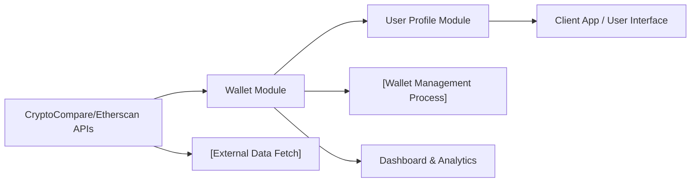

# Wallet Module

## Overview
The Wallet module enables users to manage and analyze cryptocurrency wallets through unified API endpoints. It centralizes wallet creation, retrieval, history tracking, and portfolio analysis—integrating external data from services like CryptoCompare and Etherscan—so users can monitor multiple wallets’ performance and histories within the system.

## Key Features
- **Create Wallet**: Allows users to register new cryptocurrency wallets to their profile for tracking.
- **List Wallets**: Provides retrieval of all wallets associated with a user account.
- **Delete Wallet**: Enables removal of selected wallets.
- **Wallet History**: Fetches transaction and activity history for a given wallet using external APIs.
- **Wallet Portfolio Statistics**: Offers analysis and statistics (e.g., total value, distribution, trends) on wallet holdings.

## System Errors
- **WalletNotFound**: The specified wallet ID does not exist or is not accessible to the user.  
  _Resolution_: Verify the wallet ID and ensure user authorization.
- **ExternalAPIFailure**: Unable to fetch wallet history or statistics due to errors from third-party APIs (e.g., CryptoCompare/Etherscan).  
  _Resolution_: Check API service status, ensure correct API keys/configurations, and retry the operation.
- **UnauthorizedAccess**: Attempt to perform actions on wallets without appropriate authentication.  
  _Resolution_: Authenticate and ensure the access token is valid.
- **DuplicateWallet**: Attempt to register a wallet that already exists for the user.  
  _Resolution_: Check existing wallets before creation and avoid duplicates.

## Usage Examples

```http
// Create a new wallet
POST /api/v1/wallet
Content-Type: application/json
Authorization: Bearer <access_token>

{
  "address": "0x123...abc",
  "label": "My Ethereum Wallet"
}

// List all user wallets
GET /api/v1/wallet
Authorization: Bearer <access_token>

// Fetch wallet history
GET /api/v1/history/<walletId>
Authorization: Bearer <access_token>

// Get wallet portfolio statistics
GET /api/v1/portfolio/<walletId>
Authorization: Bearer <access_token>
```

## System Integration


