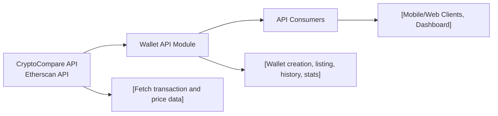

# Wallet API Module

## Overview
The Wallet API Module provides all wallet-related features in the Hetic Crypto API system. It enables users to create, manage, and analyze cryptocurrency wallets, retrieving historical transactions and portfolio statistics by integrating with external APIs such as CryptoCompare and Etherscan. This module forms the core for tracking and managing users’ crypto assets.

## Key Features
- **Create Wallet**: Enables users to register new cryptocurrency wallets for tracking and analysis.
- **List Wallets**: Allows users to fetch all wallets they have registered in the system.
- **Delete Wallet**: Provides the ability to remove a wallet and its associated data from the platform.
- **Wallet History**: Retrieves historical transaction data for a specified wallet, aggregating details from relevant third-party services.
- **Portfolio Statistics**: Computes and provides current balances, values, and analytics for a user's wallet, supporting informed decision-making.

## System Errors
- **WalletNotFound**: Occurs when a requested wallet ID is not found.  
  _Resolution_: Ensure the wallet ID is valid and belongs to the requesting user.
- **ExternalAPIUnavailable**: Triggered when CryptoCompare or Etherscan APIs are temporarily unreachable.  
  _Resolution_: Retry after some time; check network connectivity or third-party API status.
- **InvalidWalletData**: Returned if wallet creation input is missing required fields or contains malformed data.  
  _Resolution_: Validate input data against API specification before submission.

## Usage Examples
Practical code examples showing how to use the Wallet API endpoints:

```http
POST /api/v1/wallet
Content-Type: application/json

{
  "name": "Main Wallet",
  "address": "0x1234abcd..."
}
```

```http
GET /api/v1/wallet
Authorization: Bearer <access-token>
```

```http
DELETE /api/v1/wallet/<walletId>
Authorization: Bearer <access-token>
```

```http
GET /api/v1/wallet/history/<walletId>
Authorization: Bearer <access-token>
```

```http
GET /api/v1/wallet/portfolio/<walletId>
Authorization: Bearer <access-token>
```

## System Integration


