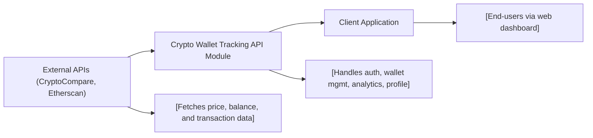

# Crypto Wallet Tracking API Module

## Overview
This module provides API endpoints and associated logic for user authentication, wallet management, and profile administration within the context of a cryptocurrency wallet tracking platform. It enables users to register, manage their crypto wallets, retrieve analytics from third-party APIs like CryptoCompare and Etherscan, and personalize their profiles. The module is foundational for the user experience in tracking, analyzing, and visualizing cryptocurrency portfolios in the application.

## Key Features
- **User Authentication & Authorization**: Secure user registration, email verification, login, logout, and token refresh operations.
- **Wallet Management**: Endpoints to create, list, and delete user wallets, interfacing with external APIs to collect and store wallet data.
- **Wallet Analytics**: Provides historical and portfolio statistics per wallet by aggregating data from CryptoCompare and Etherscan.
- **Profile Management**: Allows users to retrieve and update personal information and reset their passwords.
- **RESTful API Interface**: Well-defined endpoints (prefixed by `/api/v1`) supporting easy integration with the client application.

## System Errors
- **Invalid Credentials**: Returned when login fails due to wrong email or password.  
  _Resolution_: Ensure correct credentials and that the email is verified.
- **Expired/Invalid Token**: Requests to protected endpoints without valid tokens will fail.  
  _Resolution_: Re-authenticate or use the refresh endpoint to obtain a new token.
- **Resource Not Found**: Accessing deleted or non-existent wallets or profiles returns this error.  
  _Resolution_: Confirm the resource ID is correct.
- **External API Unreachable**: When third-party services (e.g., CryptoCompare, Etherscan) fail to respond.  
  _Resolution_: Retry after some time or check the API status.
- **Validation Errors**: Invalid or missing fields in requests (e.g., malformed emails, weak passwords).  
  _Resolution_: Supply required data with valid formats.

## Usage Examples

```http
// Register a new user
POST /api/v1/auth/register
Content-Type: application/json

{
  "email": "user@example.com",
  "password": "YourStrongPassword123"
}

// Create a new wallet
POST /api/v1/
Authorization: Bearer <access_token>
Content-Type: application/json

{
  "walletAddress": "0x123...abc"
}

// Get wallet statistics
GET /api/v1/portfolio/<walletId>
Authorization: Bearer <access_token>
```

## System Integration


