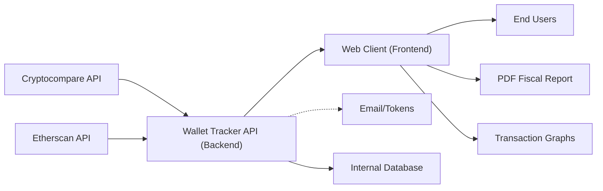

# Wallet Tracker API & Client

## Overview
The Wallet Tracker system enables users to securely register, log in, and manage multiple cryptocurrency wallets. It aggregates and analyzes wallet data by integrating with third-party APIs (Cryptocompare, Etherscan), providing key insights such as transaction history and portfolio statistics. The system includes a backend REST API and a frontend web client, working together to offer account management, crypto wallet tracking, and consolidated portfolio analytics.

## Key Features

- **User Authentication & Registration**: Secure account creation, login, email verification, logout, and access token refresh. This provides multi-session security and controls access to wallet data and analytics.

- **Wallet Management API**: Users can create, view, and delete wallets. Each wallet can be tracked and analyzed via integrations with external APIs.

- **Historical & Portfolio Data Retrieval**: APIs provide transaction history and portfolio statistics for each wallet, giving users visibility into their asset flows and current token valuations.

- **User Profile Management**: Endpoints allow users to view and edit their personal information and reset passwords, ensuring user data remains up-to-date and secure.

- **Web Client User Experience**: The frontend web application delivers core wallet and account features (dashboard, login, registration, profile), plus supplementary tools such as fiscal report PDF generation and transaction graphing.

## System Errors

- **Authentication Error**: Invalid credentials, expired or missing tokens.  
  *Resolution*: Ensure login details are correct, verify email, or refresh token.

- **API Rate Limiting / Third-Party Failures**: External APIs like Cryptocompare or Etherscan may rate-limit or become temporarily unavailable.  
  *Resolution*: Retry after some time; monitor system notifications for third-party service status.

- **Wallet Not Found**: Attempting to access or delete a wallet with an invalid or unauthorized identifier.  
  *Resolution*: Verify the wallet ID exists and belongs to the current user.

- **Profile Update Error**: Submitting invalid or incomplete data when editing user profile or resetting password.  
  *Resolution*: Check input fields for all required and properly formatted information.

## Usage Examples

```http
# Register a new account
POST /api/v1/auth/register
Content-Type: application/json
{
  "email": "user@example.com",
  "password": "strongpassword"
}

# Login
POST /api/v1/auth/login
Content-Type: application/json
{
  "email": "user@example.com",
  "password": "strongpassword"
}

# Create a new wallet
POST /api/v1/wallet
Authorization: Bearer <token>
Content-Type: application/json
{
  "address": "0xYourWalletAddress"
}

# Get wallet list
GET /api/v1/wallet
Authorization: Bearer <token>

# Retrieve wallet statistics
GET /api/v1/portfolio/<walletId>
Authorization: Bearer <token>

# Update user profile
PATCH /api/v1/profile
Authorization: Bearer <token>
Content-Type: application/json
{
  "displayName": "New Name"
}
```

## System Integration


