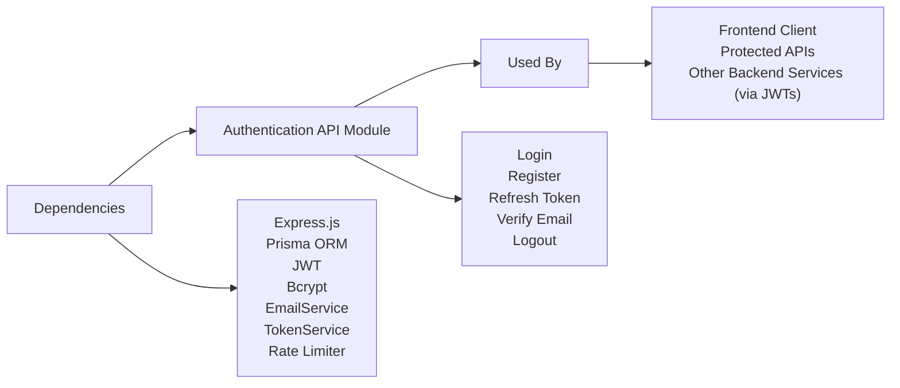

# Authentication API Module

## Overview
The Authentication API module manages user identity and session lifecycle for the application. It provides endpoints for registering users, authenticating credentials, managing tokens, verifying email addresses, and securely logging users in and out. This module is central to enforcing user access control and is integrated with other services via authentication tokens.

## Key Features
- **User Login**: Authenticates users with email and password, issuing JWT access and refresh tokens for secure session management.
- **User Registration**: Handles secure user sign-up, password hashing, and sends verification emails to activate accounts.
- **Email Verification**: Confirms user identity by validating a one-time email verification token.
- **Refresh Access Token**: Issues new access tokens using a valid refresh token to maintain user sessions without requiring re-authentication.
- **Logout**: Securely ends user sessions, invalidating the refresh token.
- **Rate Limiting**: Protects login and registration endpoints from abuse with rate limiters.
- **Cookie Management**: Uses secure HTTP-only cookies for storing sensitive refresh tokens in the browser.

## System Errors
- **Invalid Credentials**: Returned if email or password is incorrect.  
  *Resolution*: Check that the entered credentials are correct and the email is verified.
- **Email Already Registered**: Attempt to register with an existing email.  
  *Resolution*: Use the password recovery mechanism or log in.
- **Email Not Verified**: User has not completed the verification process.  
  *Resolution*: Check email inbox for the verification link and complete the process.
- **Invalid or Expired Token**: Provided refresh or verification token is invalid or has expired.  
  *Resolution*: Request a fresh verification or re-authenticate to obtain new tokens.
- **Rate Limit Exceeded**: Too many login or registration attempts.  
  *Resolution*: Wait for the rate limit window to reset.

## Usage Examples

```typescript
// User Login
POST /api/auth/login
{
  "email": "user@example.com",
  "password": "password123"
}
// Returns: { "accessToken": "jwt-token" }, sets "refreshToken" cookie

// User Registration
POST /api/auth/register
{
  "name": "Alice",
  "email": "alice@example.com",
  "password": "password123"
}
// Returns: { "message": "Registration successful. Please verify your email." }

// Email Verification
GET /api/auth/verify-email/eyJhbGciOiJIUzI1NiIsInR5cCI6...
// Returns: { "message": "Email verified successfully" }

// Refresh Access Token
POST /api/auth/refresh-access-token
// Requires refreshToken cookie set
// Returns: { "accessToken": "new-jwt-token" }

// Logout
POST /api/auth/logout
// Clears refreshToken cookie and invalidates session
// Returns: { "message": "Logged out successfully" }
```

## System Integration


