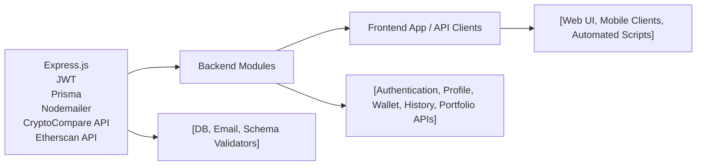

# Backend Modules

## Overview
The backend modules provide a feature-centric API for user authentication, profile management, wallet tracking, transaction history, and portfolio analytics in a cryptocurrency context. These modules enable secure user operations, interaction with wallet/blockchain data, and user insights—all through RESTful integrations designed for frontend and system-level consumption.

## Key Features
- **Authentication & Authorization**: Supports registration, login, logout, JWT-based session handling, email verification, and access/refresh token lifecycle management. Critical for securing all other module features.
- **Profile Management**: Allows users to view and edit personal information, as well as reset passwords. This maintains user-specific security and up-to-date information.
- **Wallet Management**: Enables users to create, delete, and list blockchain wallets. Each wallet is enriched with historical value data for accurate tracking and analytics.
- **Wallet History Retrieval**: Exposes transaction and balance history for user wallets, supporting filtered lookups (e.g., date range) for auditing and insight generation.
- **Portfolio Analytics**: Provides real-time and historical portfolio allocation, value, and performance metrics, including daily changes and price history.
- **Email Notifications**: Integrated email system for sending verification links and account-related notifications, driving user engagement and trust.

## System Errors
- **Invalid Credentials or Authorization Errors**: Users attempting protected routes without authentication or with wrong credentials receive statuses like 401 (Unauthorized) or 400 (Bad Request). Resolution: Ensure valid session/tokens are provided.
- **Resource Not Found**: Errors such as "Wallet not found" (404) when querying/deleting non-existent wallets. Resolution: Confirm the resource identifier (e.g., wallet ID) is correct.
- **Validation Errors**: Input data not matching expected schemas leads to 400 (Bad Request) responses. Resolution: Client-side validation or correcting data formats.
- **Email Not Verified**: Login/feature access is blocked if a user’s email is unverified. Resolution: Complete the email verification process.
- **Token Expiry or Invalid Token**: Access/refresh tokens may expire or be invalidated, resulting in 401 or other auth errors. Resolution: Re-authenticate or refresh the tokens.
- **Database Constraint Errors**: Uniqueness or foreign key violations result in specific error codes (e.g., P2002 for duplicate emails, P2025 for missing wallet). Resolution: Avoid duplicate resources and reference only existing entities.

## Usage Examples

```typescript
// User Registration
await axios.post('/api/auth/register', { name: "Alice", email: "alice@example.com", password: "secret" });

// Email Verification
await axios.get(`/api/auth/verify-email/${token}`);

// User Login (returns accessToken, sets refreshToken cookie automatically)
await axios.post('/api/auth/login', { email: "alice@example.com", password: "secret" });

// Refresh Access Token
await axios.post('/api/auth/refresh-token', {}, { withCredentials: true });

// Profile Update
await axios.put('/api/profile', { name: "Alice Updated", email: "alice@example.com" }, { headers: { Authorization: `Bearer ${accessToken}` } });

// Wallet Creation
await axios.post('/api/wallet', { address: "0xabc...", title: "My ETH Wallet" }, { headers: { Authorization: `Bearer ${accessToken}` } });

// Get Wallet History
await axios.get('/api/history/123', { headers: { Authorization: `Bearer ${accessToken}` } });

// Retrieve Portfolio Analytics
await axios.get('/api/portfolio/123', { headers: { Authorization: `Bearer ${accessToken}` } });
```

## System Integration


