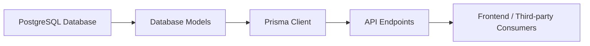

# Database Models

## Overview
The Database Models module defines the core data structures and relationships used to manage users, authentication, wallets, cryptocurrencies, and historical data within the system. By structuring entities such as User, Wallet, Currency, and related histories, this module enables consistent data storage, retrieval, and manipulation across the backend, supporting the fundamental operations of the API.

## Key Features

- **User Management**: Centralizes user information, roles (ADMIN, USER), email verification status, and links to user wallets and refresh tokens.
- **Wallet Management**: Associates blockchain wallet addresses with users, organizes wallet data, and tracks wallet activity and balances.
- **Authentication via Refresh Tokens**: Supports secure session management and token-based authentication through a dedicated RefreshToken model.
- **Cryptocurrency Tracking**: Represents supported cryptocurrencies and their attributes, enabling association between wallets, histories, and currency data.
- **Wallet History**: Records historical snapshots of wallet balances, quantities, and currency values to enable auditing and analytics.
- **Currency Price History**: Stores historic price points for each tracked cryptocurrency, useful for valuation, reporting, and analytics.
- **Role Management**: Controls access across the system by specifying user roles as ADMIN or USER within the User model.

## System Errors

- **Unique Constraint Violation**: Attempting to create users (email), wallets (address), refresh tokens (token), or currencies (symbol) with duplicate values will result in unique constraint errors.  
  *Resolution*: Ensure values are unique before attempting creation.
- **Foreign Key Constraint Failure**: Creating relationships (e.g., wallet to user, wallet history to currency) with invalid or missing references will result in database errors.  
  *Resolution*: Verify referenced entities exist before establishing relations.
- **Expired Refresh Tokens**: Using a refresh token with an `expiresAt` date in the past will prevent successful authentication.  
  *Resolution*: Request a new refresh token when this occurs.

## Usage Examples

```typescript
// Fetch a user with their wallets and wallet histories
const userWithWallets = await prisma.user.findUnique({
  where: { email: "alice@example.com" },
  include: {
    wallets: {
      include: {
        history: {
          include: { currency: true }
        }
      }
    },
    refreshToken: true
  }
});

// Create a new wallet for an existing user
const wallet = await prisma.wallet.create({
  data: {
    address: "0xABC123...",
    title: "My ETH Wallet",
    user: { connect: { id: userId } }
  }
});

// Record historical currency price
const priceEntry = await prisma.currencyHistory.create({
  data: {
    date: new Date(),
    price: 3400.25,
    currency: { connect: { id: currencyId } }
  }
});
```

## System Integration


