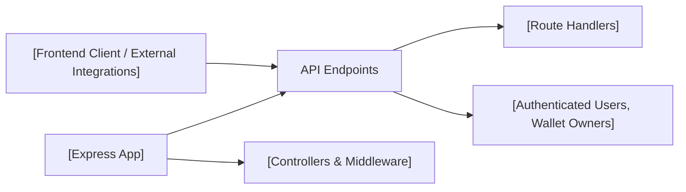

# API Endpoints

## Overview
This module defines all publicly available HTTP API endpoints for the cryptocurrency wallet tracking system. It enables account management, wallet operations, profile management, and retrieval of user portfolio and transaction history. These endpoints serve as the main integration layer for client applications to interact with user and crypto asset data.

## Key Features

- **Authentication & User Sessions**: Provides login, logout, registration, and access token refresh flows, ensuring secure access to API resources.
- **Email Verification**: Allows users to verify their accounts via email token.
- **Wallet Management**: Enables creation, retrieval, and deletion of user wallets.
- **Transaction History**: Supplies historical transaction data per wallet for user analysis.
- **Portfolio Statistics**: Exposes aggregated wallet statistics and analytics.
- **Profile Management**: Lets users view, update their profile details, and reset their password.

## System Errors

- **401 Unauthorized**: Occurs when authentication is required but not provided or invalid.  
  _Resolution_: Ensure valid access tokens are sent with requests to protected endpoints.

- **403 Forbidden**: User lacks permission to perform the requested operation.  
  _Resolution_: Confirm that the user has required rights or ownership over the wallet/resource.

- **400 Bad Request**: Invalid or missing request parameters.  
  _Resolution_: Check required parameters and request body content.

- **404 Not Found**: Requested resource (e.g., wallet ID) does not exist.  
  _Resolution_: Verify that the provided IDs or tokens match existing resources.

- **429 Too Many Requests**: Triggered when rate limits are exceeded (e.g., login/register).  
  _Resolution_: Wait and retry after the specified cooldown period.

## Usage Examples

```http
// Register a new account
POST /api/v1/auth/register
Content-Type: application/json

{
  "email": "user@example.com",
  "password": "securePassword"
}

// Login and obtain tokens
POST /api/v1/auth/login
Content-Type: application/json

{
  "email": "user@example.com",
  "password": "securePassword"
}

// Create a new wallet
POST /api/v1/wallet
Authorization: Bearer <access_token>
Content-Type: application/json

{
  "walletAddress": "0x123..."
}

// Get all user's wallets
GET /api/v1/wallet
Authorization: Bearer <access_token>

// Fetch wallet history
GET /api/v1/history/<walletId>
Authorization: Bearer <access_token>

// Fetch portfolio statistics
GET /api/v1/portfolio/<walletId>
Authorization: Bearer <access_token>

// Update user profile
PATCH /api/v1/profile
Authorization: Bearer <access_token>
Content-Type: application/json

{
  "name": "New Name"
}
```

## System Integration


