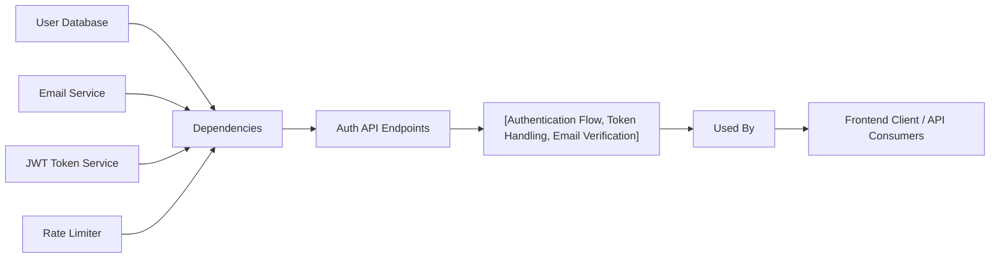

# Auth API Endpoints

## Overview
The Auth API module provides the core authentication and user session management endpoints for the system. It enables user registration, login, email verification, secure token refresh, and logout. These endpoints are essential for user identity and access flow, protecting APIs and features that require authentication.

## Key Features
- **User Registration**: Allows new users to create an account and initiates email verification.
- **User Login**: Authenticates users and issues secure authentication tokens (JWT-based).
- **Email Verification**: Verifies user ownership of email addresses.
- **Access Token Refresh**: Issues new access tokens using secure, httpOnly refresh tokens.
- **User Logout**: Revokes refresh tokens and terminates sessions securely.
- **Rate Limiting**: Applies rate limiters to login and registration routes for enhanced security.

## System Errors
- **Invalid Input**: Requests not matching the required schema return HTTP 400 with validation details.  
  *Resolution*: Ensure your input matches the required schema (e.g., valid email/password format).
- **Authentication Failure**: Incorrect credentials or missing/expired tokens return HTTP 401 Unauthorized.  
  *Resolution*: Provide correct login details, and ensure refresh tokens are present and valid.
- **Email Verification Error**: Using invalid or expired verification tokens causes HTTP 500 errors.  
  *Resolution*: Ensure the provided verification token is valid and unexpired.
- **Server/Internal Error**: Any unexpected error in the flow returns HTTP 500.  
  *Resolution*: Retry or contact support if the issue persists.

## Usage Examples

```typescript
// User Registration
POST /api/auth/register
{
  "name": "Alice Smith",
  "email": "alice@example.com",
  "password": "password123"
}
// Response: { "message": "Registration successful. Please verify your email." }

// Email Verification
GET /api/auth/verify-email/:token
// Response: { "message": "Email verified successfully" }

// User Login
POST /api/auth/login
{
  "email": "alice@example.com",
  "password": "password123"
}
// Response Header sets: Set-Cookie: refreshToken=TOKEN (HttpOnly); JSON { "accessToken": "..." }

// Refresh Access Token
POST /api/auth/refresh-access-token
// (Requires valid refresh token cookie sent automatically by browser)
// Response: { "accessToken": "..." }

// Logout
POST /api/auth/logout
// (Requires valid refresh token cookie sent automatically by browser)
// Response: { "message": "Logged out successfully" }
```

## System Integration


