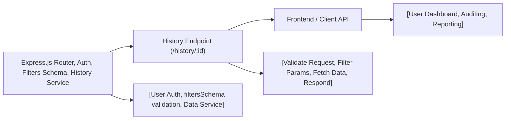

# History Endpoint

## Overview
The History endpoint provides authenticated users with access to the transaction or activity history associated with a specific wallet. It enables users or system components to retrieve historical records filtered by wallet ID and optional date, supporting features such as activity auditing and wallet balance calculations.

## Key Features
- **Fetch Wallet History**: Retrieve the complete history of a given wallet, identified by wallet ID, for the currently authenticated user.
- **Date Filtering**: Optionally filter history records to only include entries after a specified `startDate`.
- **User Access Control**: Ensures that only the owner of the wallet (authenticated user) can access the wallet’s historical data.
- **Standardized Responses**: Provides consistent JSON responses and HTTP status codes for successful and error scenarios.

## System Errors
- **Invalid Wallet ID**: The wallet ID provided in the request path is not a valid number.
  - *Resolution*: Ensure the `id` path parameter is a valid integer.
- **Wallet History Not Found**: No history records are available for the provided wallet ID and query parameters.
  - *Resolution*: Verify the wallet ID and query parameters, or check if the wallet has any recorded history.
- **Unauthorized Access**: User is not authenticated or does not own the wallet.
  - *Resolution*: Authenticate the user and ensure they are requesting their own wallet history.
- **Internal Server Error**: An unexpected server or processing error occurred.
  - *Resolution*: Check server logs for more details and ensure dependent services are healthy.

## Usage Examples

```javascript
// Example: Fetch full history for wallet #1
GET /history/1
Authorization: Bearer <token>

// Example: Fetch wallet #1 history from a specific date onwards
GET /history/1?startDate=2023-06-01T00:00:00.000Z
Authorization: Bearer <token>

// Example response
[
  {
    "transactionId": 123,
    "amount": "-0.05",
    "date": "2023-06-10T14:55:00.000Z",
    "type": "withdrawal"
  },
  {
    "transactionId": 124,
    "amount": "0.10",
    "date": "2023-06-11T09:12:00.000Z",
    "type": "deposit"
  }
]

// Example error: Invalid wallet id
{
  "error": "Invalid wallet id"
}
```

## System Integration

