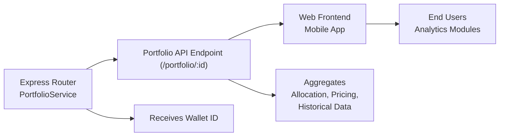

# Portfolio API Endpoint

## Overview
The Portfolio API endpoint provides aggregated information about a user's cryptocurrency portfolio, including asset allocation, historical pricing, and portfolio valuation. It serves as a central data provider for frontend applications that display portfolio analytics, breakdowns, and performance trends to end users.

## Key Features
- **Portfolio Retrieval**: Fetches detailed portfolio data for a given wallet by ID, including current asset allocation and valuation.
- **Historical Data**: Supplies historical price and value data for both portfolio assets and the entire portfolio over time.
- **Unified Response Structure**: Returns all relevant portfolio metrics (allocation, pricing, historical trends, total value) in a single, structured JSON response for client convenience.

## System Errors
- **Internal Server Error**: Indicates a failure in retrieving portfolio data (e.g., service or database issues).
  - **Resolution**: Check server logs for detailed error messages; ensure the portfolio service and data sources are operational.

## Usage Examples

```typescript
// Request
GET /api/portfolio/12345

// Successful Response
{
  "allocation": {
    "BTC": 0.5,
    "ETH": 0.3,
    "SOL": 0.2
  },
  "price": {
    "BTC": 42000,
    "ETH": 3000,
    "SOL": 100
  },
  "dailyPrice": {
    "BTC": [41000, 41500, 42000],
    "ETH": [2900, 2950, 3000],
    "SOL": [95, 98, 100]
  },
  "value": 35000,
  "dailyValue": [34000, 34500, 35000]
}

// Example error response (server issue)
{
  "message": "Failed to retrieve portfolio data"
}
```

## System Integration

