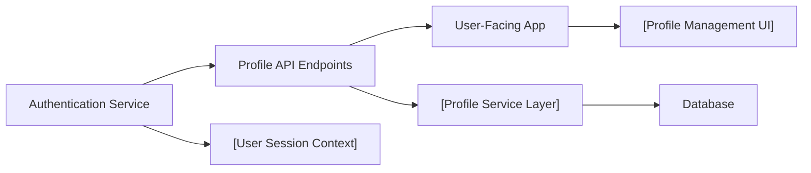

# Profile API Endpoints

## Overview
The Profile API module exposes REST endpoints for authenticated users to manage their personal profile settings within the system. It allows users to view, edit, and update their own profile information, including changing their password. This module provides a secure interface for profile management and ensures data integrity by validating input and handling conflicts.

## Key Features

- **Get Profile**: Provides authenticated users with access to their own profile information.
- **Edit Profile**: Allows users to update profile fields such as name and email, with validation and conflict (e.g., duplicate email) handling.
- **Reset Password**: Enables users to securely change their password, enforcing checks that prevent reusing the old password and requiring all necessary data.

## System Errors

- **400 Bad Request (Missing Fields)**: Triggered when required input, such as email or passwords, is missing.  
  _Resolution_: Ensure that all mandatory fields (`email` for profile edits, both passwords for password reset) are provided in the request body.
- **400 Bad Request (Duplicate/Conflict)**: Occurs when attempting to edit the profile to use an email already registered in the system.  
  _Resolution_: Use a unique email address when updating profile details.
- **400 Bad Request (Password Reuse)**: Returned if the new password matches the old one during a password reset.  
  _Resolution_: Ensure the new password is different from the old password.
- **500 Internal Server Error**: Indicates unexpected server-side errors, such as database failures.  
  _Resolution_: Check logs and resolve system/database-level issues.

## Usage Examples

```javascript
// Get current user's profile
fetch('/api/profile', { method: "GET", credentials: "include" })
  .then(res => res.json())
  .then(profile => console.log(profile));

// Update user's name and email
fetch('/api/profile', {
  method: "PATCH",
  headers: { 'Content-Type': 'application/json' },
  body: JSON.stringify({ name: "Alice Example", email: "alice@email.com" }),
  credentials: "include"
})
  .then(res => res.json())
  .then(updatedProfile => console.log(updatedProfile));

// Change user password
fetch('/api/profile/password', {
  method: "PATCH",
  headers: { 'Content-Type': 'application/json' },
  body: JSON.stringify({ oldPassword: "oldPass123", newPassword: "newPass456" }),
  credentials: "include"
})
  .then(res => res.json())
  .then(res => console.log(res));
```

## System Integration

