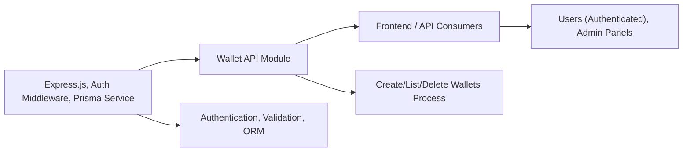

# Wallet API Endpoints

## Overview
The Wallet API module enables users to manage their cryptocurrency wallets within the system. It provides endpoints to create, list, and delete wallets for authenticated users, acting as the main interface for wallet-related actions in the broader application ecosystem.

## Key Features
- **Create Wallet**: Allows an authenticated user to add a new wallet by specifying an address and a title.
- **List Wallets**: Retrieves all wallets associated with the authenticated user, enabling them to view their registered wallets.
- **Delete Wallet**: Permits a user to remove one of their wallets using its unique identifier, ensuring users can manage their portfolio securely.

## System Errors
- **400 Bad Request**: Returned if required data (such as address or title) is missing, or if the wallet ID provided is invalid.
  - *Resolution*: Ensure all required fields are present and wallet ID is a valid number.
- **404 Not Found**: Raised when attempting to delete a wallet that does not exist.
  - *Resolution*: Confirm the wallet ID is correct and the wallet exists.
- **500 Internal Server Error**: Indicates an unexpected system error during processing.
  - *Resolution*: Check server logs for details and confirm backend dependencies are healthy.

## Usage Examples

```javascript
// Create a wallet
fetch('/api/wallet', {
  method: 'POST',
  headers: { 'Content-Type': 'application/json', 'Authorization': 'Bearer <token>' },
  body: JSON.stringify({ address: '0x123abc...', title: 'My Wallet' })
}).then(response => response.json());

// List wallets
fetch('/api/wallet', {
  method: 'GET',
  headers: { 'Authorization': 'Bearer <token>' }
}).then(response => response.json());

// Delete a wallet
fetch('/api/wallet/42', {
  method: 'DELETE',
  headers: { 'Authorization': 'Bearer <token>' }
}).then(response => {
  if (response.status === 204) {
    console.log('Wallet deleted');
  }
});
```

## System Integration

