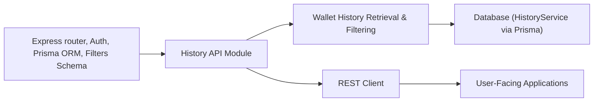

# History API Module

## Overview
The History API Module enables retrieval of wallet transaction histories for authenticated users. It serves secure, filtered access to a user's wallet history by exposing a public REST endpoint. The module ensures that users only access data belonging to their wallets, supporting optional date-based filtering.

## Key Features
- **Fetch Wallet History**: Retrieve all wallet transactions for a specific wallet owned by the user.
- **Date Filtering**: Optionally filter wallet history by providing a `startDate` query parameter, returning only transactions after the specified date.
- **User Scope Enforcement**: Automatically restricts accessible data to the requesting authenticated user to ensure privacy and security.

## System Errors
- **Invalid Wallet ID**:  
  *Description*: The provided `id` parameter is missing or not a valid integer.  
  *Resolution*: Ensure the request includes a valid numerical wallet ID.

- **Wallet History Not Found**:  
  *Description*: No history entries exist for the specified wallet/user (possibly due to empty wallet activity or unauthorized access).  
  *Resolution*: Verify the wallet has recorded activity, and that the authenticated user owns the wallet.

- **Internal Server Error**:  
  *Description*: An unexpected error occurred during processing (e.g., database issues, validation failures).  
  *Resolution*: Check the error message provided in the response for details, ensure backend services are operational, and validate request parameters.

## Usage Examples

```typescript
// Example 1: Retrieve wallet history by wallet ID
GET /api/history/123
Authorization: Bearer <token>

// Response: Array of wallet history entries
[
  {
    "id": 1,
    "walletId": 123,
    "amount": 50,
    "date": "2024-02-16T10:45:00.000Z",
    ...
  },
  ...
]

// Example 2: Retrieve wallet history after a specific date
GET /api/history/123?startDate=2024-01-01
Authorization: Bearer <token>

// Response: Array of wallet history entries after 2024-01-01
[
  {
    "id": 14,
    "walletId": 123,
    "amount": 100,
    "date": "2024-03-10T09:00:00.000Z",
    ...
  }
]
```

## System Integration

