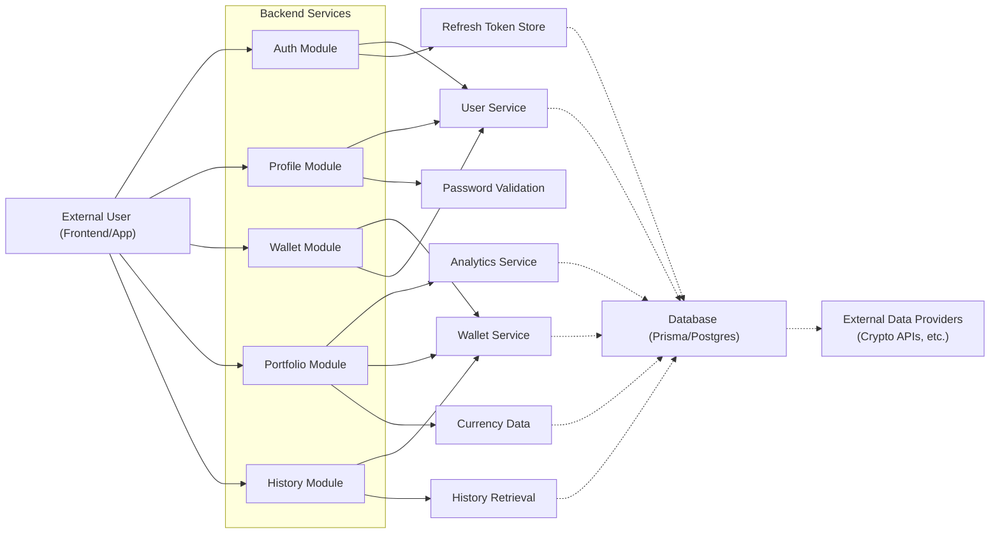

# API Modules

## Overview

This document describes the main API modules/controllers available within the backend of the Hetic Crypto API. Each module provides a set of features that manage user authentication, profile, wallets, portfolio analytics, and wallet history. These modules are the public-facing integration points for frontend applications or external clients and collectively enable secure user registration, authentication, asset tracking, and portfolio analysis within the cryptocurrency application.

## Key Features

- **User Authentication & Session Management**:  
  Handles user registration, login, logout, access-token refresh, and email verification. Provides stateless (JWT) authentication mechanisms and manages refresh tokens for secure session continuity.

- **Profile Management**:  
  Enables users to view and edit their profiles and reset passwords. Ensures that only authenticated users can change personal details or credentials.

- **Wallet Management**:  
  Allows users to create, view, and remove cryptocurrency wallets from their account. Ensures that wallet operations are restricted to authenticated, authorized users.

- **Portfolio Analytics**:  
  Exposes endpoints for retrieving portfolio composition, price history, allocation, and asset values for individual wallets.

- **Wallet History Retrieval**:  
  Provides filtered transaction and value history data of wallets, enabling time-range queries for analysis or visualization.

## System Errors

- **Validation Error**:  
  Invalid input or malformed payloads will generate a `400 Bad Request` with details on the required fields or failed validations.  
  **Resolution**: Ensure all fields meet schema requirements (e.g., valid email, strong password).

- **Authentication/Authorization Error**:  
  When JWT tokens, refresh tokens, or user credentials are missing/invalid, a `401 Unauthorized` is returned.  
  **Resolution**: Re-authenticate or use fresh tokens.

- **Resource Not Found**:  
  Accessing or modifying a wallet, user, or portfolio with non-existent IDs will result in a `404 Not Found`.  
  **Resolution**: Use valid entity IDs associated with the authenticated user.

- **Conflict/Duplicate**:  
  Attempting to register with an existing email or create duplicate wallets may return a `400 Bad Request` or similar.  
  **Resolution**: Use unique emails and wallet addresses.

- **Server Error**:  
  Unexpected failures are returned as `500 Internal Server Error`.  
  **Resolution**: Check service status or retry later.

## Usage Examples

```typescript
// User Registration
POST /api/auth/register
{
  "email": "user@example.com",
  "password": "SecureP@ssw0rd!",
  "name": "Alice"
}

// User Login
POST /api/auth/login
{
  "email": "user@example.com",
  "password": "SecureP@ssw0rd!"
}
// Response: { "accessToken": "...", (sets httpOnly refreshToken cookie) }

// Fetch Profile Data
GET /api/profile
// Authorization: Bearer <accessToken>

// Edit Profile
PUT /api/profile
{
  "name": "Alice Wonderland",
  "email": "alice@example.com"
}

// Add Wallet
POST /api/wallet
{
  "address": "0xABC...",
  "title": "My ETH Wallet"
}

// Get Portfolio Analytics
GET /api/portfolio/:walletId

// Fetch Wallet History (with date filter)
GET /api/history/:walletId?startDate=2023-01-01
```

## System Integration



- **Dependencies**: Database (via Prisma ORM), schema validation, token utilities, and external crypto APIs for price/history.
- **This Module**: API Controllers/Endpoints for authentication, user, wallet, history, and portfolio.
- **Used By**: Frontend clients and third-party consumers (browser/mobile/web-apps).
- **[Process]**: Stateless HTTP request/response cycle with validation, authorization, and error handling.
- **[Consumers]**: Authenticated users interacting with wallets, profiles, and analytics.