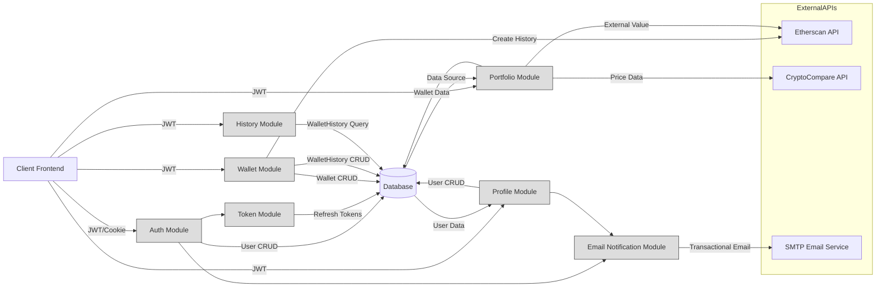

# API Modules

## Overview
This documentation provides a feature-centric overview of the major API modules responsible for user authentication, profile management, wallet operations, portfolio reporting, and wallet history tracking within the Hetic Crypto API system. Each module exposes public endpoints and services that enable core business tasks, focusing on user crypto management and security. The architecture centers around controllers that orchestrate business services, integrate with third-party APIs, and manage secure flows.

## Key Features

- **User Authentication & Authorization**: 
  Handles user registration, login, JWT-based access and refresh tokens, email verification, secure logout, and token renewal. Designed to enforce security and access control for all modules.

- **Profile Management**: 
  Enables users to fetch and update profile details, including secure email changes and password resets, with validation/error feedback and enforced re-verification on sensitive changes.

- **Wallet Management**: 
  Lets users create new wallets, list all personal wallets, and delete wallets, while managing corresponding historical data and validations (e.g., for duplicate/invalid addresses).

- **Portfolio Reporting**: 
  Retrieves a user's wallet allocation, crypto price data (real-time/historic), total value, daily value changes, and portfolio performance by integrating with external crypto APIs.

- **Wallet History Tracking**: 
  Provides filtered views of historical wallet balances and performance, supporting date-based queries and returning organized transaction/event histories for audit and analytics.

- **Email Notifications**: 
  Delivers transactional and verification emails, such as account confirmation requests when users register or update emails.

- **Token Management**: 
  Manages generation, validation, saving, and rotation of JWT access and refresh tokens underpinning all secure flows.

## System Errors

- **ValidationError**: 
  Triggered when user data fails input validation (e.g., missing fields, incorrect formats).  
  *Resolution*: Ensure request body matches required schema.

- **AuthenticationError**: 
  Raised when login credentials are incorrect, tokens are missing/invalid/expired, or email is not verified.  
  *Resolution*: Re-authenticate or verify email as instructed in returned error message.

- **ResourceNotFound**: 
  For requests referencing missing resources, such as a non-existing wallet or history.  
  *Resolution*: Confirm referenced IDs exist for that user and retry.

- **ConflictError**: 
  Raised if attempting to register or update a profile with an email already in use.  
  *Resolution*: Use a unique email address for registration or update.

- **TokenExpiredError**: 
  Raised when access or refresh tokens have expired.  
  *Resolution*: Re-login or use the refresh endpoint (if available) to obtain a new token.

- **ServerError**: 
  Any unexpected failure during API or third-party service interactions.  
  *Resolution*: Retry after a short period; contact support if persistent.

## Usage Examples

```typescript
// User Registration
POST /auth/register
{
  "name": "Alice",
  "email": "alice@example.com",
  "password": "StrongP@ssword!"
}
// Response: { "message": "Registration successful. Please verify your email." }

// User Login
POST /auth/login
{
  "email": "alice@example.com",
  "password": "StrongP@ssword!"
}
// Response: { "accessToken": "<JWT>", Set-Cookie: refreshToken }

// Get User Profile
GET /profile
Authorization: Bearer <accessToken>

// Create a Wallet
POST /wallet
{ "address": "0x...", "title": "My ETH Wallet" }
Authorization: Bearer <accessToken>

// Get Portfolio for Wallet
GET /portfolio/:walletId
Authorization: Bearer <accessToken>

// Fetch Wallet Transaction History
GET /history/:walletId?startDate=2024-01-01
Authorization: Bearer <accessToken>
```

## System Integration


