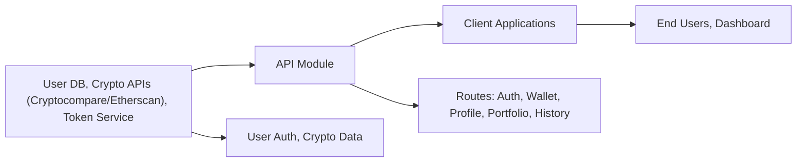

# API Module Overview

## Overview
The API module provides a unified set of endpoints for user authentication, wallet management, portfolio analysis, transaction history, and user profile handling in the Hetic Crypto Wallet Tracker system. It serves as the main integration point between client applications and backend services, securely orchestrating access, data flow, and interaction with external crypto data sources (e.g., Cryptocompare, Etherscan).

## Key Features

- **User Authentication**: Manages registration, login, email verification, token refresh, and logout. Ensures that only authorized users can access sensitive operations.
- **Wallet Management**: Allows users to create, view, and delete cryptocurrency wallets tracked by the platform.
- **Profile Management**: Enables users to retrieve, update, and modify profile information, including secure password reset.
- **Portfolio Analysis**: Provides real-time and historical portfolio statistics, such as asset allocation and value breakdown, by integrating with external cryptocurrency data providers.
- **Transaction History**: Delivers comprehensive wallet transaction logs, supporting date filtering and user-based access control.

## System Errors

- **Authentication Errors**: Occur when provided credentials are invalid, or required tokens are missing/expired.
  - *Resolution*: Ensure correct login credentials, verify tokens are valid, refresh/re-login as needed.
- **Validation Errors**: Triggered by missing or malformed input data across endpoints (e.g., invalid email format, missing wallet address).
  - *Resolution*: Confirm all required fields are correctly provided and input formats match expectations.
- **Resource Not Found**: Returned when referencing non-existent wallets, histories, or profiles.
  - *Resolution*: Check resource identifiers (e.g., wallet IDs) are accurate and belong to the authenticated user.
- **Conflict/Error on Edit**: For example, updating a profile with an email already in use.
  - *Resolution*: Use unique data for conflicting fields or handle errors as prompted.
- **Server/Internal Errors**: Unexpected issues in processing requests.
  - *Resolution*: Retry the request and contact system maintainers if errors persist.

## Usage Examples

```http
# Register a new user
POST /api/v1/auth/register
Content-Type: application/json
{
  "name": "Alice Doe",
  "email": "alice@example.com",
  "password": "securePassword123"
}

# Login to receive access/refresh tokens
POST /api/v1/auth/login
Content-Type: application/json
{
  "email": "alice@example.com",
  "password": "securePassword123"
}

# Create a wallet (requires authentication)
POST /api/v1/wallet
Authorization: Bearer <accessToken>
Content-Type: application/json
{
  "address": "0xDEADBEEF...",
  "title": "My Ether Wallet"
}

# Retrieve portfolio statistics for a wallet
GET /api/v1/portfolio/1

# Get wallet transaction history
GET /api/v1/history/1?startDate=2023-01-01
Authorization: Bearer <accessToken>
```

## System Integration


