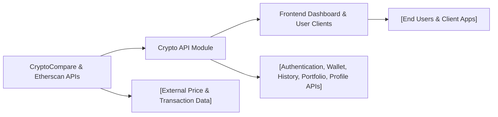

# Crypto API Overview

## Overview
The Crypto API module serves as the backend interface for managing user accounts, wallets, and cryptocurrency portfolio data. It provides secure endpoints for user authentication, wallet management, transaction history, and portfolio statistics retrieval. Designed to integrate with third-party services like CryptoCompare and Etherscan, it offers a unified API for users to track, analyze, and manage their digital assets.

## Key Features
- **User Authentication & Authorization**: Allows users to register, log in, verify emails, and securely manage access tokens. Ensures only authorized access to user-specific data.
- **Wallet Management**: Enables users to create, list, and delete cryptocurrency wallets, serving as the basis for all further interactions.
- **Transaction History Retrieval**: Provides a history endpoint to fetch all actions and movements related to a specific wallet.
- **Portfolio Statistics**: Aggregates and returns analytics and statistics for a given wallet (e.g., overall asset performance).
- **Profile Management**: Lets users view and update their profile information, including password resets.

## System Errors
- **Authentication Error**: Occurs on invalid credentials or expired tokens. Resolution: Log in again or refresh the access token.
- **Validation Error**: Triggered by malformed input or missing fields. Resolution: Review and correct the request payload.
- **Resource Not Found**: Returned when requested wallet or user data does not exist. Resolution: Ensure the correct identifier is used.
- **Rate Limit Exceeded**: Enforced on registration and login to prevent abuse. Resolution: Wait before retrying or contact support.

## Usage Examples

```http
// Register a new user
POST /api/v1/auth/register
Content-Type: application/json

{
  "email": "user@example.com",
  "password": "SecurePass123"
}

// Create a new wallet
POST /api/v1/wallet/
Authorization: Bearer <access_token>
Content-Type: application/json

{
  "name": "Main Crypto Wallet",
  "address": "0xabc123..."
}

// Retrieve wallet history
GET /api/v1/history/<walletId>
Authorization: Bearer <access_token>

// Fetch portfolio statistics
GET /api/v1/portfolio/<walletId>
```

## System Integration

