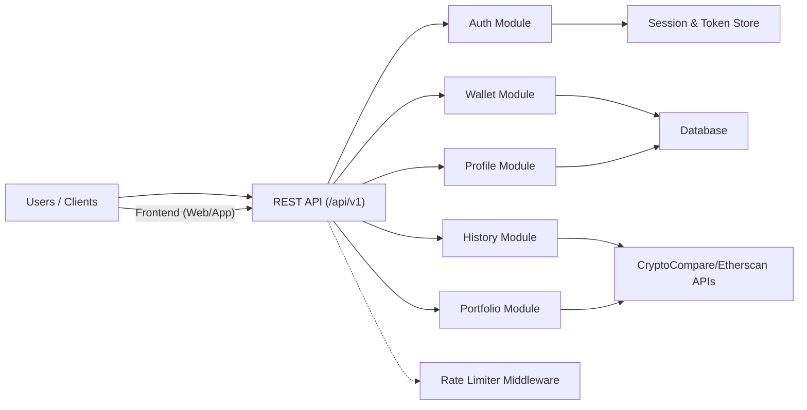

# API Overview

## Overview
The API is the backend core of the wallet tracker application, enabling user authentication, wallet management, profile configuration, transaction history tracking, and crypto portfolio analysis. It centralizes all operations needed for users to interact with their cryptocurrency data, leveraging external providers like CryptoCompare and Etherscan, while enforcing robust security and user/session management.

## Key Features

- **User Authentication**: Securely register, log in, verify emails, refresh tokens, and log out via `/auth` endpoints.
- **Wallet Management**: Create, view, and delete cryptocurrency wallets. Core endpoints are under `/wallet` with operations protected by access tokens.
- **Profile Management**: Retrieve and update user profile details, including password resets, via `/profile`.
- **Wallet History Retrieval**: Fetch the transaction and balance history for each wallet with `/history/:walletId` (requires authentication).
- **Portfolio Analytics**: Access aggregated statistics and analytics for a given wallet via `/portfolio/:walletId` (publicly readable for integration), integrating data from external cryptocurrency APIs.
- **Session & Rate Limiting**: Request throttling on sensitive operations (such as login/register) to prevent abuse.

## System Errors

- **AuthenticationError**: Returned when access tokens are missing, invalid, or expired. Resolution: Re-authenticate or refresh the access token.
- **ValidationError**: Occurs on malformed requests (e.g., missing fields during registration). Resolution: Check request format and required parameters.
- **NotFoundError**: Happens when accessing non-existent resources (e.g., unknown wallet ID). Resolution: Verify resource IDs and existence.
- **RateLimitError**: Triggered when login or registration limits are exceeded. Resolution: Wait before retrying; check for potential abuse/mistaken automated requests.
- **ConflictError**: Seen during duplicate registrations (email already in use). Resolution: Use the password reset flow or choose a different email.

## Usage Examples

```http
POST /api/v1/auth/register
Content-Type: application/json

{
  "email": "user@example.com",
  "password": "StrongPassword123"
}
```

```http
POST /api/v1/auth/login
Content-Type: application/json

{
  "email": "user@example.com",
  "password": "StrongPassword123"
}
```

```http
POST /api/v1/wallet/
Authorization: Bearer <access_token>
Content-Type: application/json

{
  "name": "Main Wallet",
  "address": "0x123abc..."
}
```

```http
GET /api/v1/history/abc123
Authorization: Bearer <access_token>
```

```http
GET /api/v1/portfolio/abc123
```

## System Integration


- **Dependencies**: Database, external crypto APIs (CryptoCompare, Etherscan), session/token storage, rate limiter.
- **This Module**: Provides public API endpoints for all core features—auth, wallet, profile, history, portfolio.
- **Used By**: Frontend application/dashboard and any integrations consuming wallet and portfolio analytics features.