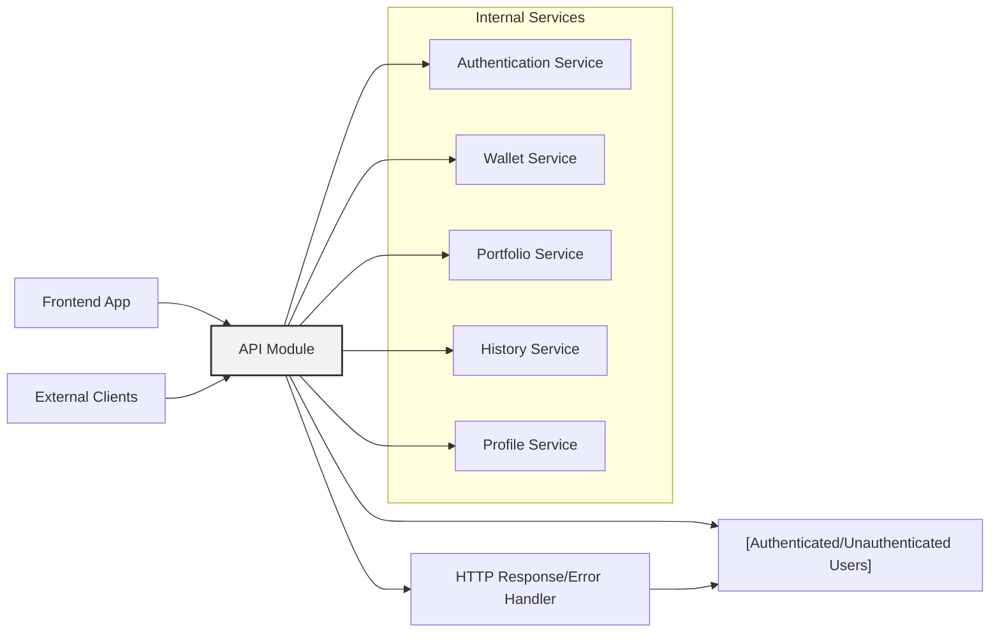

# API Overview

## Overview
The API module provides a unified interface for authentication, wallet management, user portfolio, transaction history, and profile management within the crypto portfolio application. It serves as the gateway for frontend and external clients to securely access and manipulate user-specific crypto data and actions, enforcing authentication and offering essential user account capabilities.

## Key Features

- **User Authentication**
  - Endpoints for login, registration, logout, and email verification.
  - Provides JWT-based access and refresh token management for secure session handling.

- **Wallet Management**
  - Create, list, and delete user crypto wallets.
  - Ensures wallet operations are scoped to authenticated users.

- **Portfolio Overview**
  - Retrieve a detailed snapshot of any wallet's asset allocation and valuation.
  - Exposes price trends and value metrics for portfolio analysis.

- **Transaction History**
  - Fetch transaction history for a specific wallet, filterable by date.
  - Ensures only the authenticated owner accesses their transaction records.

- **Profile Management**
  - View and edit user profile data (email, name).
  - Secure password reset functionality, enforcing integrity through checks.

## System Errors

- **Authentication Failure**
  - Returned when tokens are missing, invalid, or expired.
  - **Resolution**: Ensure a valid JWT is sent or re-authenticate via the login or refresh endpoint.

- **Validation Error**
  - Occurs when input data fails schema validation (e.g., missing required fields, invalid formats).
  - **Resolution**: Review error message details and correct request payload.

- **Not Found**
  - E.g., request for a non-existent wallet or transaction history.
  - **Resolution**: Verify resource identifiers and ownership.

- **Conflict/Error Code P2002/P2025**
  - P2002: Account or wallet creation/editing fails due to duplicate or conflicting data.
  - P2025: Deletion fails because the resource does not exist.
  - **Resolution**: Use unique data and verify resources exist before operation.

- **Internal Server Error**
  - Caters to unexpected system failures.
  - **Resolution**: Contact support or try the operation later.

## Usage Examples

```typescript
// User Login
const response = await fetch('/api/auth/login', {
  method: 'POST',
  headers: { 'Content-Type': 'application/json' },
  body: JSON.stringify({ email: 'user@example.com', password: 'secret' })
});
const data = await response.json();
const accessToken = data.accessToken;

// Get Wallets (Requires Auth)
const wallets = await fetch('/api/wallet', {
  headers: { 'Authorization': `Bearer ${accessToken}` }
}).then(res => res.json());

// Create Wallet
await fetch('/api/wallet', {
  method: 'POST',
  headers: {
    'Content-Type': 'application/json',
    'Authorization': `Bearer ${accessToken}`
  },
  body: JSON.stringify({ address: '0x...', title: 'Main' })
});

// Fetch Portfolio Overview
const portfolio = await fetch('/api/portfolio/1').then(res => res.json());

// Get Transaction History (Requires Auth)
const history = await fetch('/api/history/1?startDate=2023-01-01', {
  headers: { 'Authorization': `Bearer ${accessToken}` }
}).then(res => res.json());

// Edit Profile
await fetch('/api/profile', {
  method: 'PATCH',
  headers: {
    'Content-Type': 'application/json',
    'Authorization': `Bearer ${accessToken}`
  },
  body: JSON.stringify({ name: 'Jane Doe', email: 'jane@xyz.com' })
});
```

## System Integration


