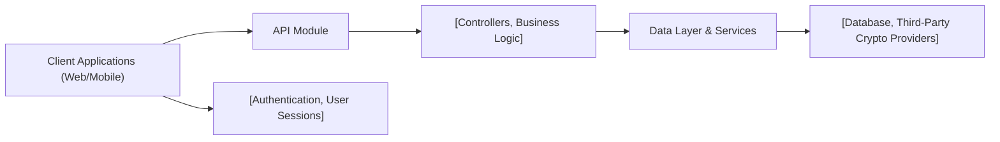

# API Overview

## Overview
This API provides a set of feature-centric endpoints for user authentication, account management, crypto wallet operations, portfolio tracking, and transaction history retrieval. It serves as the integration point between client applications and backend business logic, enabling secure access to crypto-related services.

## Key Features
- **User Authentication**: Supports login, registration, token refreshing, email verification, and logout to ensure secure access control.
- **Profile Management**: Enables retrieval and modification of user profile information, including password resets.
- **Wallet Management**: Allows users to create, view, and delete wallets for managing their crypto holdings.
- **Portfolio Tracking**: Provides endpoints to fetch users’ crypto inventory and performance data.
- **Transaction History**: Enables users to retrieve their transaction history for auditing and tracking purposes.
- **Rate Limiting**: Protects authentication endpoints from abuse by applying request rate limiters.

## System Errors
- **401 Unauthorized**: Returned when requests lack valid authentication credentials. Ensure the proper token is sent.
- **403 Forbidden**: Returned when a user tries to access data or endpoints without the correct permissions.
- **404 Not Found**: Triggered when a specified resource (e.g., wallet, profile) does not exist.
- **429 Too Many Requests**: Returned when rate limiting is triggered on authentication endpoints. Wait and retry after some time.
- **400 Bad Request**: Occurs with invalid input parameters. Check and correct your request payload.
- **500 Internal Server Error**: Indicates unexpected server-side errors. Retry, or contact support if persistent.

## Usage Examples

```typescript
// User Registration
fetch('/api/auth/register', {
  method: 'POST',
  body: JSON.stringify({ email: 'user@example.com', password: 'secure123' }),
  headers: { 'Content-Type': 'application/json' }
});

// User Login
fetch('/api/auth/login', {
  method: 'POST',
  body: JSON.stringify({ email: 'user@example.com', password: 'secure123' }),
  headers: { 'Content-Type': 'application/json' }
});

// Fetch Profile Data (after login)
fetch('/api/profile', {
  method: 'GET',
  headers: { 'Authorization': 'Bearer YOUR_ACCESS_TOKEN' }
});

// Create New Wallet
fetch('/api/wallet', {
  method: 'POST',
  body: JSON.stringify({ walletName: 'Primary BTC Wallet' }),
  headers: { 'Authorization': 'Bearer YOUR_ACCESS_TOKEN', 'Content-Type': 'application/json' }
});

// Retrieve Transaction History
fetch('/api/history/USER_ID', {
  method: 'GET',
  headers: { 'Authorization': 'Bearer YOUR_ACCESS_TOKEN' }
});
```

## System Integration


