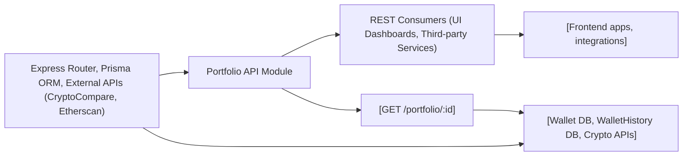

# Portfolio API Module

## Overview
The Portfolio API module provides an endpoint for retrieving aggregated portfolio information for a specific cryptocurrency wallet. This includes current allocation, price, historical daily price change, the wallet's value in fiat, and day-over-day portfolio value change. The module streamlines portfolio insights for applications such as dashboards or financial overviews.

## Key Features
- **Portfolio Retrieval**: Fetches comprehensive portfolio data for a given wallet ID, including allocations, prices, and value metrics.
- **Asset Valuation**: Aggregates real-time and historical pricing data from external services (CryptoCompare, Etherscan) to present live and previous values of the specified wallet.
- **Daily Performance Tracking**: Calculates percentage changes and absolute changes in value over the last day for better investment insights.
- **REST Endpoint**: Exposes a single GET API endpoint for easy integration by front-end or third-party consumers.

## System Errors
- **Internal Server Error**: Returned if there's any failure during portfolio calculation or third-party API communication.  
  _Resolution_: Examine the message in the error payload for more details; check connectivity to external APIs and ensure the wallet ID is valid.
- **Wallet Not Found / Invalid Wallet ID**: If an invalid or non-existent wallet ID is provided, the response may not contain relevant data.  
  _Resolution_: Verify the wallet ID exists in the system before querying.

## Usage Examples

```typescript
// Request example using fetch (browser or Node.js)

fetch("https://your-api-domain/portfolio/12345")
  .then(response => response.json())
  .then(data => {
    /*
      {
        allocation: number,
        price: number,
        dailyPrice: number,
        value: number,
        dailyValue: number
      }
    */
    console.log("Portfolio Data:", data);
  })
  .catch(error => {
    console.error("Failed to fetch portfolio:", error);
  });
```

## System Integration


