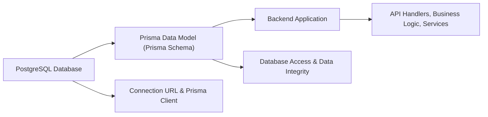

# Prisma Data Model (Prisma Schema)

## Overview
The Prisma Data Model defines the central database schema for the Hetic Crypto API. It establishes the structure, relationships, and types for critical domain objects (such as users, wallets, currencies, and history) in a PostgreSQL database, powering the core data layer for authentication, user management, wallets, and crypto price tracking features. This module enables all backend features to interact with underlying persistent storage through Prisma's client APIs.

## Key Features

- **User and Authentication Modeling**: Represents users, their roles (user/admin), authentication credentials, email verification status, and refresh tokens for secure access and session management.
- **Wallet Management**: Models multiple user-owned crypto wallets and enables tracking of their addresses, titles, and related transaction histories.
- **History Tracking**: Stores and relates historical records for wallet balances (WalletHistory) and cryptocurrency prices (CurrencyHistory), allowing for auditing, reporting, and value tracking over time.
- **Currency Management**: Defines and maintains supported cryptocurrencies (with symbols, names, and unique constraints), and links them to wallet and currency histories.
- **Relational Integrity**: Establishes explicit foreign key relationships between users, wallets, tokens, and currency tables to ensure data integrity and clear entity connections.
- **Enum Role Management**: Introduces a `Role` enumeration to separate user permissions, supporting both administrative and end-user functionality.

## System Errors

- **Unique Constraint Violation**: Occurs if inserting duplicate values for fields like `User.email`, `Wallet.address`, `Currency.symbol`, or `RefreshToken.token`.  
  **Resolution**: Ensure unique values are provided for each of these fields before attempting creation.

- **Foreign Key Constraint Failure**: Triggered when referencing non-existent records in related tables (e.g., creating a wallet linked to a missing `userId`).  
  **Resolution**: Confirm referenced records exist before performing operations involving foreign keys.

- **Missing Required Fields**: All non-optional model fields (e.g., `User.email`, `Wallet.address`) must be provided.  
  **Resolution**: Validate all required data before submitting mutations or creation requests.

## Usage Examples

```typescript
import { PrismaClient } from '@prisma/client';

const prisma = new PrismaClient();

// Create a new user and associated wallet
const newUser = await prisma.user.create({
  data: {
    email: 'alice@example.com',
    password: 'hashedpassword',
    name: 'Alice',
    wallets: {
      create: [
        {
          address: '0xwalletaddress1',
          title: 'Primary Wallet'
        }
      ]
    }
  },
});

// Add a historical record for a wallet
await prisma.walletHistory.create({
  data: {
    date: new Date(),
    quantity: 1.5,
    value: 45000,
    walletId: 1,          // Replace with actual Wallet ID
    currencyId: 1         // Replace with actual Currency ID
  }
});

// Insert a new currency and price history
const currency = await prisma.currency.create({
  data: {
    symbol: 'BTC',
    name: 'Bitcoin',
  }
});
await prisma.currencyHistory.create({
  data: {
    date: new Date(),
    price: 30000,
    currencyId: currency.id
  }
});
```

## System Integration


