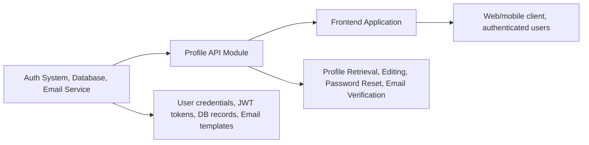

# Profile API Module

## Overview

The Profile API module manages authenticated users' profile information in the system. It provides endpoints for retrieving user profile data, updating user details (name/email), and securely resetting passwords. This module ensures consistent user experience for personal data management, while integrating with authentication and email verification flows.

## Key Features

- **Get Profile**: Fetches the current authenticated user's profile information (name, email).
- **Edit Profile**: Allows users to update their name and/or email address, triggering re-verification if the email is changed.
- **Reset Password**: Enables users to change their password securely, validating existing credentials and updating them safely.

## System Errors

- **Account Edition Failed (P2002)**: Occurs when attempting to update a profile with a non-unique email address or other constraint issues.  
  *Resolution*: Ensure the provided email is not already in use.

- **Missing Required Fields**: Triggered if email (on profile edit), or old/new password (on password reset) are not provided.  
  *Resolution*: Always include required fields in API requests.

- **New Password Same As Old**: Returned if the new password matches the old password during a reset.  
  *Resolution*: Provide a different value for the new password.

- **Incorrect Old Password**: Returned if the provided old password does not match records.  
  *Resolution*: Verify and input the correct current password.

- **Internal Server Error**: For all other unhandled errors; includes a message for debugging.  
  *Resolution*: Check the error message and server logs for more information.

## Usage Examples

```javascript
// Fetch the current user's profile
fetch('/api/profile', {
  method: 'GET',
  headers: { Authorization: 'Bearer <token>' }
})
  .then(res => res.json())
  .then(data => console.log(data));

// Edit user profile (name and email)
fetch('/api/profile', {
  method: 'PATCH',
  headers: {
    'Content-Type': 'application/json',
    Authorization: 'Bearer <token>',
  },
  body: JSON.stringify({ name: "Alice", email: "alice@example.com" }),
})
  .then(res => res.json())
  .then(data => console.log(data));

// Reset password
fetch('/api/profile/password', {
  method: 'PATCH',
  headers: {
    'Content-Type': 'application/json',
    Authorization: 'Bearer <token>',
  },
  body: JSON.stringify({ oldPassword: "old_pass", newPassword: "new_pass123" }),
})
  .then(res => res.json())
  .then(data => console.log(data));
```

## System Integration


