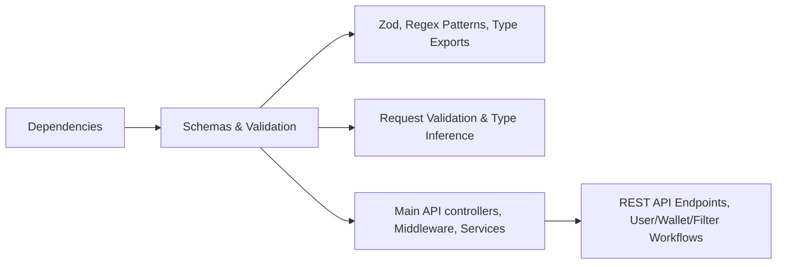

# Schemas and Validation

## Overview
The Schemas and Validation module centralizes user data validation and request structure enforcement across authentication, profile management, wallet operations, and data filtering workflows. Using structured schemas, this module ensures consistent input data formats and robust error messaging throughout API endpoints, directly improving system reliability, user experience, and security.

## Key Features

- **Authentication Schema Validation**: Enforces email and password format requirements during registration and login, including strong password rules for enhanced security.
- **Profile Schema Validation**: Validates user email and name updates; ensures secure password change operations with strict complexity requirements.
- **Wallet Data Validation**: Standardizes the required structure for wallet-related data, including address and title fields.
- **Advanced Filters Validation**: Structures the input for filtering wallet transactions or queries, enabling flexible but validated requests based on wallet/user/date fields.
- **Type Inference Integration**: Exports schema types to streamline type-safe API request handling throughout the backend.

## System Errors

- **Invalid Email Format**: Triggered when email does not meet the standard format.
  - *Resolution*: Ensure the email string is correctly formatted (e.g., "user@example.com").
- **Password Complexity Error**: Triggered by passwords not meeting minimum length or lacking required character types.
  - *Resolution*: Use a password with at least 8 characters, combining uppercase, lowercase, number, and special character.
- **Missing or Malformed Fields**: Occurs if required fields are absent or incorrectly typed.
  - *Resolution*: Supply all required fields using correct types, referring to API schema documentation.
- **Invalid Date Format (Filters)**: Raised when date values are not correctly parsed as Date objects.
  - *Resolution*: Submit dates using valid ISO format or compatible date representations.

## Usage Examples

```typescript
import { registerSchema, loginSchema } from "./schemas/auth.schemas";
import { profileSchema, passwordSchema } from "./schemas/profile.schemas";
import { walletSchema } from "./schemas/wallet.schemas";
import { filtersSchema } from "./schemas/filters.schemas";

// Validate registration payload
const regData = { email: "user@domain.com", password: "Abc$1234", name: "Alice" };
registerSchema.parse(regData); // Throws on invalid input

// Validate password change
const changePayload = { oldPassword: "Old$Pass1", newPassword: "New$Pass2" };
passwordSchema.parse(changePayload);

// Validate wallet creation
const walletPayload = { address: "0x12ab", title: "Main Wallet" };
walletSchema.parse(walletPayload);

// Validate filters for wallet queries
const filterPayload = {
  walletId: 1,
  wallet: { user: { id: 7 } },
  date: { gte: new Date("2024-06-01") }
};
filtersSchema.parse(filterPayload);
```

## System Integration


