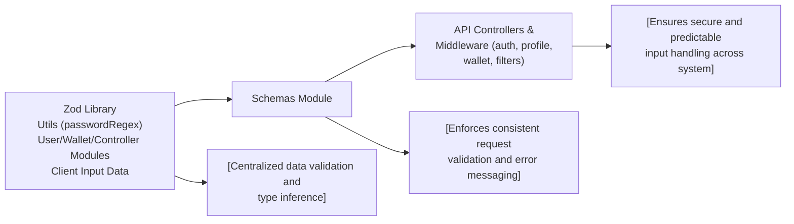

# Schemas Module

## Overview
The Schemas module defines and centralizes all data validation rules used across the API for requests and objects related to authentication, profiles, wallets, and filtered queries. By leveraging Zod schemas, this module ensures the structure and integrity of incoming data, providing secure, predictable data handling for service endpoints and middleware throughout the system.

## Key Features
- **User Authentication Schemas**: Validates user input for registration, login, and internal authentication processes, enforcing password complexity and email formats.
- **Profile Management Schemas**: Defines data validation for user profile updates and password changes, ensuring data consistency and security.
- **Wallet Data Schema**: Validates wallet-related data structures, such as wallet addresses and titles.
- **Transaction Filter Schemas**: Specifies rules for complex, nested filter queries on wallet-linked data, including date filtering and user scoping.
- **Type Extraction for Systemwide Consistency**: Exposes strongly-typed schema definitions for use in controllers, middleware, and documentation, ensuring all parts of the system rely on the same validation standards.

## System Errors
- **ValidationError**: Occurs when incoming data does not match the required schema (e.g., wrong email format, password policy not met).  
  **Resolution**: Ensure that client inputs conform to schema requirements as described in the API documentation.
- **MissingFieldError**: Triggered if a required property (such as email or wallet address) is missing in the request.  
  **Resolution**: Verify that all fields required by the schema are present in the request payload.
- **MalformedDateError**: For date filters, if the provided value cannot be parsed as a date object.  
  **Resolution**: Send a valid JavaScript Date object or properly formatted date string.

## Usage Examples

```typescript
import { registerSchema, walletSchema, filtersSchema } from "schemas";

// Registration input validation example
const registrationInput = { email: "user@demo.com", password: "StrongP@ssw0rd", name: "Alice" };
registerSchema.parse(registrationInput); // Throws if invalid

// Wallet validation example
const walletInput = { address: "0x123...", title: "My Wallet" };
walletSchema.parse(walletInput); // Throws if structure is incorrect

// Transaction filters validation example
const filtersInput = {
  walletId: 1,
  wallet: { user: { id: 1 } },
  date: { gte: new Date("2024-01-01") }
};
filtersSchema.parse(filtersInput); // Throws if nested structure is incorrect
```

## System Integration


