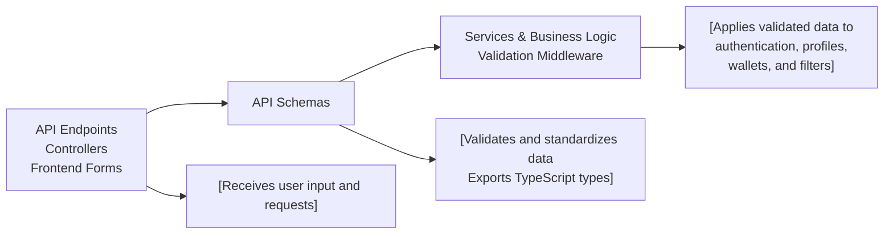

# API Schemas

## Overview
API Schemas define the validation and type structure for core data used throughout the hetic-crypto-api system. These schemas ensure data integrity, standardize request and response payloads, and safeguard against malformed or invalid input. They form the foundation for user authentication, profiles, wallet management, and filtered data operations across the system.

## Key Features
- **User Authentication Schemas**: Validate user registration and login data, ensuring robust security requirements on credentials.
- **Profile Management Schemas**: Define and enforce the structure for user profile updates and password changes.
- **Wallet Information Schema**: Standardizes the format for wallet details used in transactions and user portfolios.
- **Filtered Data Access Schema**: Structures filter criteria for queries on wallet data and user-associated entities.
- **Type Exports**: Offers ready-to-use TypeScript types inferred from schemas, supporting type-safe API contracts throughout the application.

## System Errors
- **Validation Error**: Occurs when incoming data does not match schema rules (e.g., invalid email format, weak password).  
  **Resolution**: Provide correctly formatted values as specified by schema requirements (e.g., valid email, password with required complexity).
- **Type Mismatch Error**: Triggered if data does not conform to expected types (e.g., providing a string for a numerical field).  
  **Resolution**: Ensure each field matches its expected data type according to the schema.

## Usage Examples

```typescript
import { registerSchema, loginSchema } from "backend/src/schemas/auth.schemas";
import { profileSchema, passwordSchema } from "backend/src/schemas/profile.schemas";
import { walletSchema } from "backend/src/schemas/wallet.schemas";
import { filtersSchema } from "backend/src/schemas/filters.schemas";

// Validating user registration input
const registrationInput = { email: "user@email.com", password: "Strong!Passw0rd", name: "Alice" };
const parseResult = registerSchema.safeParse(registrationInput);

// Checking wallet data before storing
const walletInput = { address: "0x123…abcd", title: "My Main Wallet" };
walletSchema.parse(walletInput);

// Filtering data queries
const filtersInput = { walletId: 42, wallet: { user: { id: 7 } }, date: { gte: new Date() } };
filtersSchema.parse(filtersInput);

// Updating profile
const profileInput = { email: "alice@email.com", name: "Alice" };
profileSchema.parse(profileInput);
```

## System Integration


