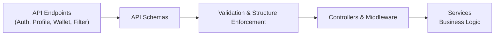

# API Schemas

## Overview
The API Schemas module provides centralized data validation and structure enforcement across critical authentication, user profile, wallet, and filtering operations in the system. By ensuring that request and response data matches expected formats, this module helps maintain data consistency and protects against malformed or malicious input at the public API layer.

## Key Features

- **Authentication Schemas**: Validates user credentials, registration, and session-related data to maintain security and consistency during authentication flows.
- **Profile Schemas**: Enforces the structure and validation of user profile updates, including sensitive changes like password updates.
- **Wallet Schemas**: Ensures wallet data (such as addresses and titles) meet the required standards during creation or modification.
- **Filtering Schemas**: Validates data used for filtering resources (e.g., transactions by wallet or user), supporting robust query capabilities.

## System Errors

- **ValidationError**: Triggered when request data does not meet schema definitions (e.g., invalid email, weak password, missing required fields). Resolution: Review the validation error message, correct the input, and retry the operation.
- **MalformedDateError**: Occurs if date values provided in filters are not valid dates. Resolution: Ensure that all date fields conform to ISO date standards.
- **UnauthorizedDataFormat**: When data structure does not conform to what is expected by middlewareSchema (e.g., missing id or email for middleware authentication). Resolution: Ensure the JWT or session payload includes all mandatory fields.

## Usage Examples

```typescript
import { registerSchema, loginSchema } from "./schemas/auth.schemas";
import { profileSchema, passwordSchema } from "./schemas/profile.schemas";
import { walletSchema } from "./schemas/wallet.schemas";
import { filtersSchema } from "./schemas/filters.schemas";

// Validate registration form
const parsedUser = registerSchema.parse({
  email: "alice@example.com",
  password: "P@ssw0rd2024",
  name: "Alice Smith"
});

// Validate login input
const parsedLogin = loginSchema.safeParse({
  email: "alice@example.com",
  password: "P@ssw0rd2024"
});

// Validate profile update
const validProfile = profileSchema.parse({
  email: "alice@example.com",
  name: "Alice Smith"
});

// Validate password change request
const validPasswordChange = passwordSchema.parse({
  oldPassword: "P@ssw0rd2023",
  newPassword: "N3wP@ssStrong!"
});

// Validate new wallet
const myWallet = walletSchema.parse({
  address: "0xAbC123...",
  title: "My Main Wallet"
});

// Validate filtering query
const filter = filtersSchema.parse({
  walletId: 42,
  wallet: { user: { id: 1 } },
  date: {
    gte: new Date("2024-01-01")
  }
});
```

## System Integration


