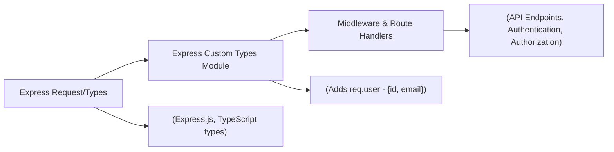

# Express Custom Types

## Overview
This module extends the default Express.js `Request` type to include a custom `user` property. It allows middleware and route handlers to access authenticated user information (such as `id` and `email`) directly on the request object. This module facilitates type-safe user data propagation during request handling across the API.

## Key Features
- **User Property on Request**: Adds an optional `user` property to Express's `Request` interface for storing authenticated user details.
- **Type-Safe User Access**: Ensures strong typing when accessing user info (`id` and `email`) throughout the API, reducing errors and improving code clarity.

## System Errors
- **Missing User Property**: If middleware assumes that `req.user` exists when it does not (e.g., on unauthenticated requests), this can lead to `undefined` errors.
  - **Resolution**: Always check for the existence of the `user` property (`if (req.user) { ... }`) before accessing its fields.
- **Incorrect User Assignment**: Assigning an improperly structured object to `req.user` (missing `id` or `email`) may cause runtime or compile-time type errors.
  - **Resolution**: Ensure setters (typically authentication middleware) populate `req.user` with both required properties.

## Usage Examples

```typescript
import express, { Request, Response, NextFunction } from 'express';

// Example authentication middleware that sets req.user
function authMiddleware(req: Request, res: Response, next: NextFunction) {
  // For demonstration: assign user if JWT or session is valid
  req.user = { id: 'abc123', email: 'user@example.com' };
  next();
}

const app = express();

app.use(authMiddleware);

app.get('/me', (req: Request, res: Response) => {
  if (!req.user) {
    return res.status(401).json({ error: 'Not authenticated' });
  }
  res.json({ userId: req.user.id, userEmail: req.user.email });
});
```

## System Integration


