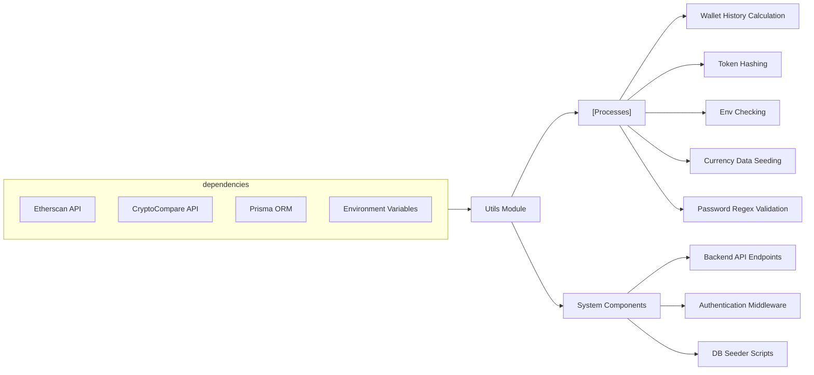

# Utils Module

## Overview
The Utils module provides essential utility functions for cryptocurrency operations, environment validation, token hashing, database seeding with historical currency data, and input validation through common regex patterns. These utilities support core workflows across the backend, handling blockchain data fetching, environment integrity, security, and data preparation.

## Key Features

- **Wallet History Generation**: Fetches and builds per-day Ether balance changes for a given Ethereum wallet by aggregating normal and internal transactions using the Etherscan API.
- **Environment Variable Verification**: Checks the presence and validity of all required environment variables at application startup, enforcing proper configuration.
- **Refresh Token Hashing**: Offers secure hashing for tokens (such as refresh tokens) using HMAC SHA-256 for secure storage or comparison.
- **Historical Price Seeding**: Downloads and loads historical cryptocurrency price data from CryptoCompare into the database, crucial for analytics and historical queries.
- **Password Policy Regex**: Provides a standard regular expression pattern to validate passwords, ensuring they meet complexity requirements (upper/lowercase, digit, special character, minimum length).

## System Errors

- **Missing Environment Variables**:  
  *Description*: When the application starts and required environment variables are missing or empty, an error is thrown.  
  *Resolution*: Ensure all environment variables listed in `REQUIRED_ENV_VARS` are set and non-empty before running the backend.
  
- **Etherscan API/Parsing Error**:  
  *Description*: If a call to the Etherscan API fails or the response indicates an error (`status: "0"`), logging occurs and blockchain data fetching stops for that wallet.  
  *Resolution*: Check the Etherscan API key validity, network connectivity, or API limits on your Etherscan account.
  
- **CryptoCompare API/Data Error**:  
  *Description*: If fetching or parsing data from CryptoCompare fails, the history seeding logs an error and skips affected data slices.  
  *Resolution*: Verify your CryptoCompare API key, inspect network issues, or try again later.
  
- **Database Upsert Error**:  
  *Description*: During currency history seeding, if the database upsert fails, the error is logged.  
  *Resolution*: Inspect schema, database connection, Prisma migration status, and ensure data model alignment.

## Usage Examples

```typescript
// 1. Wallet History Generation
import { createWalletHistory } from "./etherscan.ts";
const history = await createWalletHistory("0xd0b08671ec13b451823ad9bc5401ce908872e7c5");
console.log(history); // Per-day ether value history array

// 2. Environment Variable Verification
import { verifyEnv } from "./verify-env.ts";
verifyEnv(); // Throws error if required env vars are missing

// 3. Refresh Token Hashing
import { hashToken } from "./hash-refresh-token.ts";
const hashed = hashToken("refreshTokenValue", "serverSecret");

// 4. Seeding Currency History (CryptoCompare)
import "./seed.ts"; // On execution, cleans and populates currency history database

// 5. Password Regex Validation
import { passwordRegex } from "./regex.ts";
const isValid = passwordRegex.test("Str0ng!Pass123"); // true if valid
```

## System Integration


