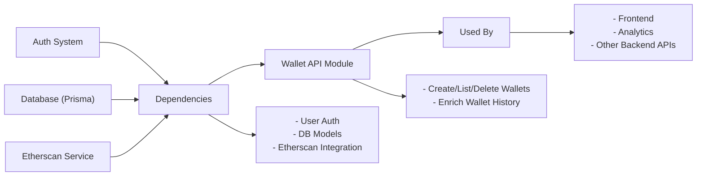

# Wallet API Module

## Overview
The Wallet API module manages user cryptocurrency wallets within the system. It enables secure creation, retrieval, and deletion of wallets tied to users, while integrating with historical pricing and transaction history tracking features. This module is central for associating wallet addresses to user accounts and providing wallet-related data for downstream services and analytics.

## Key Features
- **Add Wallet**: Allows authenticated users to register a new wallet by supplying an address and title. Automatically enriches the wallet history with price data and transaction history.
- **Delete Wallet**: Permits users to remove an existing wallet by its ID, including all historical data associated with the wallet.
- **List Wallets**: Fetches all wallets belonging to the authenticated user, supporting wallet management and overview features.

## System Errors
- **Invalid Wallet ID**: Returned if a provided wallet ID is not a valid number.  
  _Resolution_: Ensure the ID parameter is a positive integer.
- **Wallet Not Found (P2025)**: Occurs if a wallet ID does not exist or does not belong to the user.  
  _Resolution_: Confirm the wallet exists and the user has access rights.
- **Missing Address/Title**: Returned if required `address` or `title` fields are missing during creation.  
  _Resolution_: Include both `address` and `title` fields in the request body.
- **ETH Currency Not Found**: Returns internal error if ETH currency data is missing from the system.  
  _Resolution_: Ensure "ETH" is present in the currency table.
- **Internal Server Error**: Generic catch-all for unexpected issues such as database problems.  
  _Resolution_: Review server logs for detailed diagnostics.

## Usage Examples

```typescript
// Add a new wallet
POST /wallet
Headers: { Authorization: "Bearer <token>" }
Body: {
  "address": "0xABC123...",
  "title": "Main Ethereum Wallet"
}
// Response: { id: 7, userId: 1, address: "0xABC123...", title: "Main Ethereum Wallet", ... }

// List wallets for authenticated user
GET /wallet
Headers: { Authorization: "Bearer <token>" }
// Response: [{ id: 7, address: "0xABC123...", title: "Main Ethereum Wallet" }, {...}]

// Delete a wallet
DELETE /wallet/7
Headers: { Authorization: "Bearer <token>" }
// Response: HTTP 204 No Content
```

## System Integration


