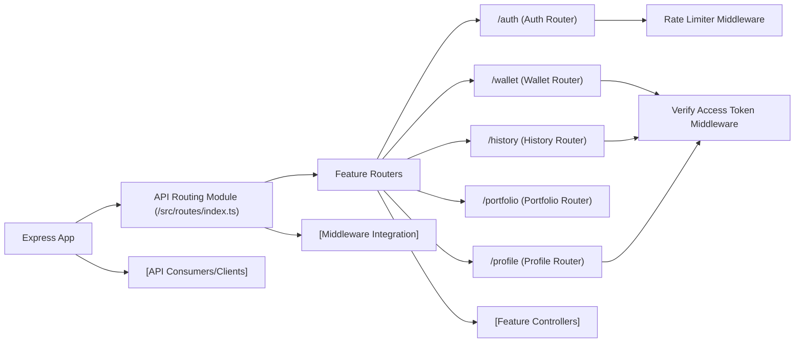

# API Routing Module

## Overview
The API Routing module serves as the central entry point for all API endpoints in the backend. It defines and organizes the top-level API routes, connecting each feature-specific sub-router (e.g., authentication, wallet management) to the main application. Additionally, it enforces access control and rate limiting policies by integrating critical middleware where required.

## Key Features

- **Centralized Route Aggregation**: Collects and registers all major route groups (`/auth`, `/wallet`, `/history`, `/portfolio`, `/profile`) in one place, improving maintainability and discoverability.
- **Middleware Integration**: Applies authentication (`verifyAccessToken`) and rate limiting (`loginLimiter`, `registerLimiter`) selectively to safeguard sensitive endpoints.
- **Route Isolation**: Each functionality area (e.g., authentication, user profile, wallet management) is encapsulated in its own router, keeping responsibilities clear and simplifying updates.
- **Consistent API Structure**: Ensures all endpoints follow a predictable and organized path schema, making the API easier for clients to use and for developers to extend.

## System Errors

- **401 Unauthorized**: Returned when endpoints protected by `verifyAccessToken` are accessed without a valid JWT.  
  _Resolution_: Ensure you include a valid access token in the request headers.
- **429 Too Many Requests**: Triggered by the rate limiter when login or registration attempts exceed allowed thresholds.  
  _Resolution_: Wait for the cooldown period before retrying the request.
- **404 Not Found**: Returned if a route or resource does not exist (e.g., requesting a non-existent wallet or portfolio ID).  
  _Resolution_: Double-check the endpoint and parameters used in the request.
- **400 Bad Request**: Occurs when required data is missing or malformed (e.g., trying to create a wallet with incomplete fields).  
  _Resolution_: Verify request payload validity and required fields.

## Usage Examples

```typescript
// Example: Registering top-level routers in an Express app

import express from "express";
import { router as apiRouter } from "./src/routes/index";

const app = express();

// API routes mounted under /api
app.use("/api", apiRouter);

// Example: Making an authenticated request to get wallet info
// (client-side usage)
fetch("/api/wallet", {
  method: "GET",
  headers: { Authorization: "Bearer <access_token>" }
});
```

## System Integration


