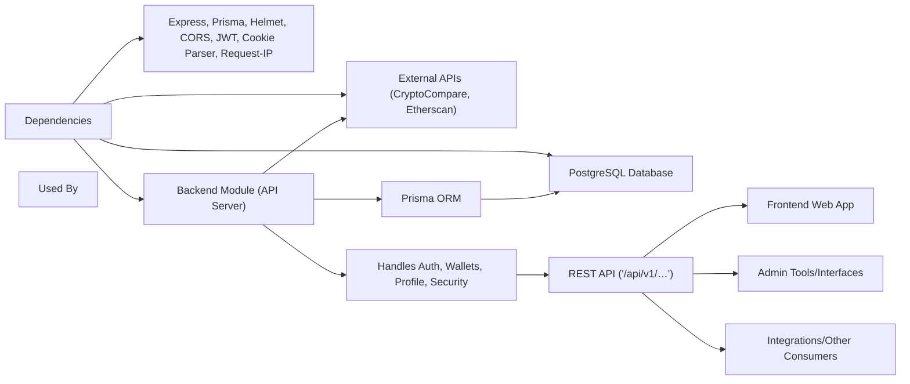

# Backend Architecture

## Overview
The Backend module serves as the foundational API and service layer for the wallet tracker system. It exposes multiple public endpoints, manages user registration/authentication, wallet handling, profile management, and interacts with a PostgreSQL database through Prisma ORM. Its main purpose is to aggregate, secure, and serve user and portfolio data, integrating external APIs for cryptocurrency analysis and tracking.

## Key Features
- **REST API Endpoints**: Exposes public routes for user authentication, wallet management, profile operations, and wallet statistics. All API endpoints are prefixed with `/api/v1`.
- **Authentication Management**: Supports account registration, email verification, login, logout, and secure token refreshing using JWT and refresh tokens.
- **Wallet Operations**: Allows users to create, list, and remove wallets. Also provides endpoints to fetch wallet history and portfolio statistics.
- **Profile Management**: Enables users to retrieve and update personal information and reset passwords securely.
- **Prisma ORM Integration**: Efficient interaction with a PostgreSQL database; manages users, wallets, transaction histories, and currency data using the Prisma schema.
- **Security Middleware**: Utilizes Helmet for basic HTTP security headers and CORS for controlled cross-origin communication.
- **Cookie & IP Handling**: Parses user cookies and tracks client IPs for both security and analytics.

## System Errors
- **Authentication Errors**: Invalid credentials, expired tokens, or unverified email.  
  *Resolution*: Ensure account is created and verified; refresh tokens or re-login as needed.
- **Authorization Errors**: Unauthorized access to protected resources.  
  *Resolution*: Confirm user is logged in and possesses the necessary roles (e.g., ADMIN/USER).
- **Validation Errors**: Malformed requests or missing fields.  
  *Resolution*: Check request body and parameters match expected API contract (e.g. correct JSON schema).
- **Database Errors**: Record not found, unique constraint violations (e.g., duplicate wallet address or email).  
  *Resolution*: Verify input data for uniqueness before submitting; handle not found responses gracefully.
- **API Rate Limiting**: Excessive requests are blocked.  
  *Resolution*: Reduce request frequency or implement exponential backoff in client code.

## Usage Examples
_Practical uses of the backend module’s public API routes:_

**User registration**
```typescript
// Register a new user
fetch('https://your-api-domain/api/v1/auth/register', {
  method: 'POST',
  headers: { 'Content-Type': 'application/json' },
  body: JSON.stringify({ email: "user@mail.com", password: "your_password", name: "User" })
});
```

**Add a wallet**
```typescript
// Create a new wallet for the authenticated user
fetch('https://your-api-domain/api/v1/wallet', {
  method: 'POST',
  credentials: 'include',
  headers: { 'Authorization': 'Bearer <access_token>', 'Content-Type': 'application/json' },
  body: JSON.stringify({ address: "0x123...", title: "My ETH Wallet" })
});
```

**Fetch wallet history**
```typescript
// Retrieve transaction history for a specific wallet
fetch('https://your-api-domain/api/v1/history/<walletId>', {
  method: 'GET',
  credentials: 'include',
  headers: { 'Authorization': 'Bearer <access_token>' }
});
```

**Update user profile**
```typescript
// Update user information
fetch('https://your-api-domain/api/v1/profile', {
  method: 'PATCH',
  credentials: 'include',
  headers: { 'Authorization': 'Bearer <access_token>', 'Content-Type': 'application/json' },
  body: JSON.stringify({ name: "New Name" })
});
```

## System Integration


