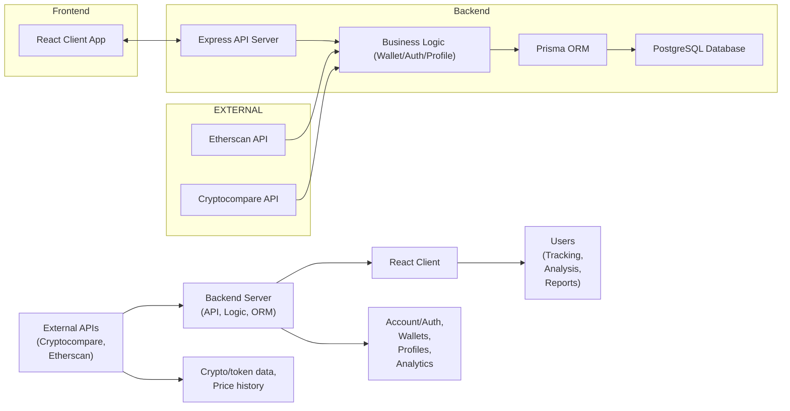

# Architecture Overview

## Overview
This document provides a high-level, feature-centric description of the architecture in the Hetic Crypto API project. The system enables users to securely register, authenticate, aggregate their cryptocurrency wallet data, analyze portfolio history and statistics, and interact via a web-based client interface. It integrates external data sources (Cryptocompare, Etherscan) and supports user account management, wallet tracking, and portfolio analysis features.

## Key Features

- **User Authentication & Authorization**:  
  Provides secure registration, login, email verification, password management, and token-based session support. Ensures account integrity and access control.

- **Wallet Management**:  
  Allows users to create, delete, and list cryptocurrency wallets. Associates each wallet with a user account and supports management of multiple wallets.

- **Portfolio History & Analytics**:  
  Fetches and stores wallet transaction history and up-to-date portfolio statistics, enabling users to view value, currency breakdown, and historical analytics over time.

- **User Profile Management**:  
  Exposes endpoints for users to update their personal information and reset passwords, enhancing account personalization and security.

- **External API Integration**:  
  Periodically fetches data from third-party services like Cryptocompare and Etherscan to provide accurate, real-time wallet and currency information.

- **Web Client Interface**:  
  A React-based frontend that enables authentication, wallet management, dashboard analytics, and user profile access.

## System Errors

- **Authentication Error**:  
  *Description*: Invalid credentials, expired verification token, or unauthorized access attempts.  
  *Resolution*: Ensure credentials are correct, request a new verification link, or refresh the session token.

- **Wallet Not Found / Invalid Address**:  
  *Description*: Attempts to fetch, delete, or interact with a wallet that does not exist or has an invalid address format.  
  *Resolution*: Validate the wallet ID/address format on the frontend before submission and check for existence.

- **External Service Unavailable**:  
  *Description*: Failure to synchronize or fetch currency/wallet data due to external API downtime.  
  *Resolution*: Retry the operation. The backend should offer meaningful error messages and degrade gracefully.

- **Permission Denied**:  
  *Description*: Attempting to modify or access wallets/profiles/resources owned by other users.  
  *Resolution*: Only operate on resources associated with the authenticated user.

## Usage Examples

```http
// Register a new user
POST /api/v1/auth/register
Body: { "email": "user@example.com", "password": "strongpassword", "name": "User" }

// Verify email
GET /api/v1/auth/verify-email/<token>

// Log in a user
POST /api/v1/auth/login
Body: { "email": "user@example.com", "password": "strongpassword" }

// Add a wallet
POST /api/v1/wallet
Body: { "address": "0x123...", "title": "Main ETH Wallet" }

// Get wallets
GET /api/v1/wallet

// Get portfolio statistics
GET /api/v1/wallet/portfolio/<walletId>
```

## System Integration


