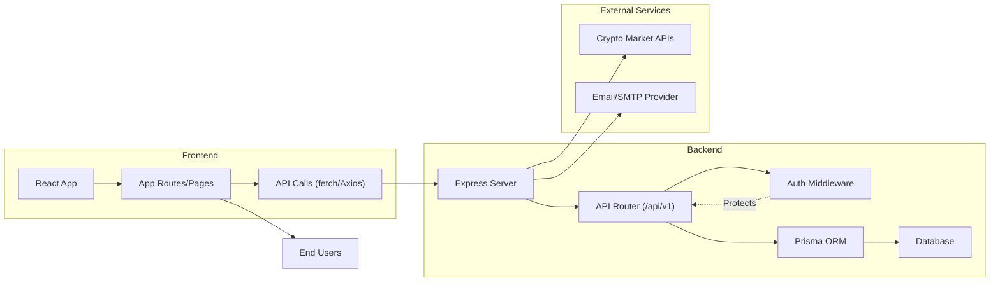

# Architecture

## Overview
This system is a full-stack cryptocurrency portfolio management application consisting of a Node.js/Express backend and a React frontend. The backend provides secure API endpoints for authentication, user portfolio handling, wallet management, and transaction history, while the frontend offers a user-centric interface for interaction and data visualization. The architecture emphasizes modularity, security, and real-time data access.

## Key Features

- **User Authentication & Authorization**: 
  - Secure JWT-based authentication with token expiration and refresh capabilities.
  - Endpoint protection using middleware for authenticated routes (wallet, history, profile).

- **RESTful API Endpoints**:
  - Modular routing for features like authentication, wallet management, transaction history, portfolio, and profile.
  - Explicit versioning of the API (e.g., `/api/v1`).

- **Security & Middleware**:
  - Helmet for secure HTTP headers.
  - CORS configuration for trusted client-server communication.
  - Cookie parsing and IP extraction middleware.

- **Persistence Layer**:
  - Centralized database interactions using Prisma ORM.

- **Rate Limiting & Config Management**:
  - Environment variable validation and rate limiting on sensitive endpoints (login, register).

- **Frontend Integration & Navigation**:
  - React-based SPA with route-based navigation.
  - Authentication context provider for stateful login/logout across views.
  - Protected routes enforcing authorization on critical pages like Dashboard and Profile.

- **Modularization**:
  - Logical separation of backend routes and frontend pages/components for scalable development.

## System Errors

- **Invalid or Missing JWT Token**:
  - Occurs when accessing protected endpoints without a valid token.
  - **Resolution**: Ensure client attaches a valid Authorization header; re-authenticate if token is expired.

- **Rate Limit Exceeded**:
  - Thrown when exceeding set requests for login/register within the window.
  - **Resolution**: Wait for the window to reset before retrying the action.

- **Missing Required Environment Variables**:
  - Backend won’t start if any critical env variable (e.g., `DATABASE_URL`, `JWT_SECRET`, `PORT`, etc.) is not set.
  - **Resolution**: Set missing variables as listed in `REQUIRED_ENV_VARS`.

- **Database Connection Error**:
  - Occurs if Prisma cannot connect to the database.
  - **Resolution**: Ensure database server is running and credentials (including `DATABASE_URL`) are correct.

## Usage Examples

```javascript
// Example: Fetching user wallet (frontend)

fetch("http://localhost:4000/api/v1/wallet", {
  method: "GET",
  credentials: "include", // ensures cookies/JWTs are sent
  headers: {
    "Authorization": "Bearer <ACCESS_TOKEN>"
  }
})
.then(res => res.json())
.then(data => {
  // handle wallet data
});

// Example: Protecting a frontend route
<Route
  path="/dashboard"
  element={
    <ProtectedRoute>
      <Dashboard />
    </ProtectedRoute>
  }
/>

// Example: Backend middleware usage
app.use("/api/v1", router); // All API endpoints grouped under versioned router
```

## System Integration


