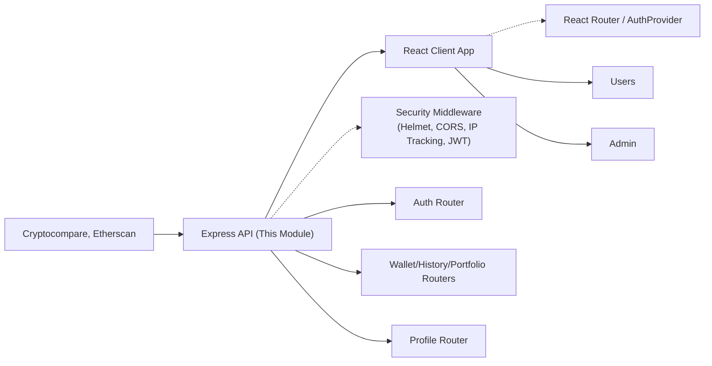

# Architecture Module

## Overview
This module defines the global architecture of the "Monolith" crypto wallet tracker system—an all-in-one platform for retrieving, visualizing, and analyzing cryptocurrency wallet data. The architecture is structured as a client-server monolith, where a React-based client communicates with a Node.js/Express API backend. The backend aggregates data from external APIs (e.g., Cryptocompare, Etherscan), performs authentication and core business logic, and exposes REST endpoints for wallet management, analytics, and user profiles.

## Key Features
- **API Routing and Modularization**: All backend endpoints are namespaced under `/api/v1`, organized into feature-based routers for responsibilities like authentication, wallets, history, portfolio stats, and user profiles.
- **Authentication and Authorization**: Supports JWT (token-based) authentication with endpoints for registration, login, email verification, logout, and token refresh. Sensitive routes require valid access tokens.
- **Wallet Aggregation and History**: Enables users to create, view, and delete wallets, fetch wallet transaction history, and compute portfolio statistics via integrated external services.
- **User Profile Management**: Allows retrieval and edit of personal user information and password reset. Profile endpoints are secured and device-aware (using IP tracking).
- **Frontend-Backend Integration**: The client application routes user requests and data visualizations through secure, versioned API endpoints, ensuring the frontend always interacts with backend services through unified and predictable contracts.
- **Security Middleware**: Backend applies `helmet` for HTTP header protection, `cors` with controlled origins, secure cookie management, and IP recognition to mitigate common threats and enhance session security.

## System Errors
- **401 Unauthorized**: Returned when endpoints requiring authentication are accessed without a valid access token. Resolution: Ensure the user is logged in and their session is still valid.
- **400 Bad Request**: Triggered by malformed requests, invalid input data, or missing required fields. Resolution: Validate request payloads on the client before submission.
- **404 Not Found**: Occurs when accessing undefined routes or invalid wallet/profile identifiers. Resolution: Check and correct API endpoint paths and resource IDs.
- **500 Internal Server Error**: Indicates an unexpected backend failure, commonly caused by upstream API outages or coding errors. Resolution: Retry after some time; contact support if persistent.

## Usage Examples

```js
// Example: Fetch a user's wallets from the frontend

fetch("/api/v1/wallet", {
  method: "GET",
  credentials: "include",
  headers: {
    "Authorization": `Bearer ${accessToken}`,
  }
})
  .then(res => res.json())
  .then(data => {
    // data contains the list of wallets
    console.log(data);
  });

// Example: Register a new user

fetch("/api/v1/auth/register", {
  method: "POST",
  headers: { "Content-Type": "application/json" },
  body: JSON.stringify({
    email: "user@example.com",
    password: "securePassword123"
  })
})
  .then(res => res.json())
  .then(response => {
    // response includes user info or verification instructions
    console.log(response);
  });
```

## System Integration


