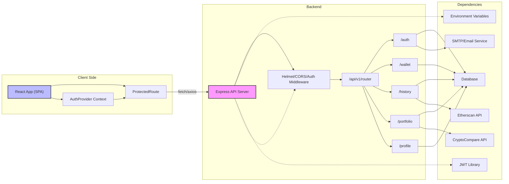

# System Architecture Overview

## Overview
This architecture consists of a backend API server (Node.js/Express) and a client web application (React). The backend provides secure, token-based authentication, manages user accounts, digital wallets, transaction history, and portfolio information. The React frontend consumes these APIs, handling user navigation and access control based on authentication status.

## Key Features

- **Secure RESTful API**: The backend exposes all core features through a versioned `/api/v1` endpoint, following REST conventions for resource access (auth, wallet, history, portfolio, profile).
- **JWT Authentication**: Implements short-lived access and longer-lived refresh tokens, cookie storage, and token validation for protected routes. Sensitive routes are guarded with middleware.
- **Throttling & Protection**: Rate limiting for login and registration endpoints, usage of Helmet for HTTP headers, and CORS configuration tailored for the client domain.
- **User Account Management**: APIs support registration, login, profile management, and email verification.
- **Wallet & Portfolio APIs**: Backend supports creation, retrieval, and management of crypto wallets and portfolio data, enforcing security via authentication middleware.
- **Transaction & History Tracking**: Users can track transaction history, with APIs requiring authentication.
- **React SPA (Single Page Application)**:
  - **Routing & Auth Context**: Client-side routing with route protection (e.g., dashboard/profile pages) based on user authentication status.
  - **User Experiences**: Pages for login, registration, dashboard, profile, portfolio tracking, and more.

## System Errors

- **Invalid Token**: Occurs when protected endpoints are accessed without a valid JWT.  
  *Resolution*: Ensure user is authenticated and token is fresh; re-login may be required.

- **CORS Error**: Client is unable to connect because the browser blocks requests to an untrusted backend URL.  
  *Resolution*: Verify that the backend's `CLIENT_URL` environment variable matches the frontend origin.

- **Missing Environment Variables**: The backend checks for critical environment settings on startup.  
  *Resolution*: Define all variables listed in `REQUIRED_ENV_VARS` before deploying the backend.

- **Too Many Requests (Rate Limiting)**: Exceeded allowed number of attempts for login or registration.  
  *Resolution*: Wait for a cooldown period before retrying or reduce frequency of requests.

## Usage Examples

```js
// --- Making an authorized wallet request from the client ---
fetch(`${process.env.REACT_APP_API_URL}/api/v1/wallet`, {
  method: "GET",
  credentials: "include",
  headers: {
    "Content-Type": "application/json",
    Authorization: `Bearer <access_token>`,
  },
})
  .then(res => res.json())
  .then(data => { /* handle wallet info */ })
  .catch(err => { /* handle errors */ });

// --- Protecting frontend routes in React ---
<Route
  path="/dashboard"
  element={
    <ProtectedRoute>
      <Dashboard />
    </ProtectedRoute>
  }
/>
```

## System Integration

