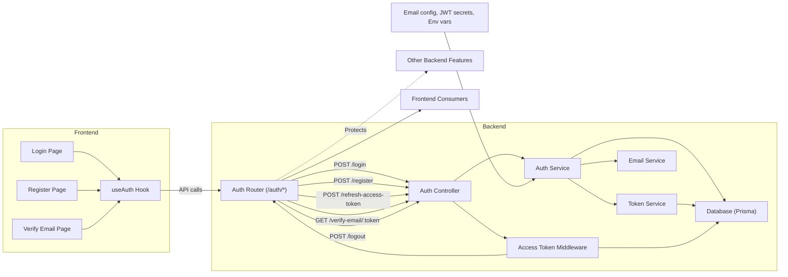

# Authentication Module

## Overview
The Authentication module provides user login, registration, email verification, token-based authentication, session management, and logout functionality for the system. It handles the entire user authentication lifecycle and is the primary integration point between frontend user actions and backend identity management. This module ensures secure access to system features, supports token refresh, and uses best security practices like JWTs, cookies, and input validation.

## Key Features

- **User Registration**: Allows new users to sign up by submitting their email, name, and password. Triggers an email verification workflow to ensure user authenticity.
- **Email Verification**: Sends a verification email to new users upon registration. Activates the user account when the email is verified via a token link.
- **User Login**: Authenticates users using their email and password. Issues an access token and a refresh token upon successful login.
- **Token-Based Authentication**: Uses short-lived access tokens for API authentication and refresh tokens (stored as secure, HttpOnly cookies) for session continuity.
- **Token Refresh**: Enables users to obtain a new access token using a valid refresh token. Maintains seamless user sessions without forcing frequent logins.
- **Logout**: Invalidates the user's session by deleting the refresh token and clearing the authentication cookie.
- **Access Token Verification Middleware**: Protects secure routes by verifying the user's JWT access token on each API request.
- **Rate Limiting**: Applies rate limiting to registration and login endpoints to guard against brute-force and abuse.

## System Errors

- **Invalid Credentials**: Returned when the login email is not registered or if the password is incorrect. Resolution: Ensure the correct credentials are used.
- **Email Not Verified**: Returned if a user attempts to log in before completing email verification. Resolution: Click the verification link sent by email.
- **Email Already Registered**: Returned when attempting to register with an email that is already in use. Resolution: Use a different email or reset the password.
- **Validation Errors**: Invalid input (e.g., malformed email, weak password). Resolution: Correct the input based on the validation message.
- **Invalid/Expired Refresh Token**: Returned if the refresh token is missing, expired, or invalid during token refresh or logout. Resolution: Log in again to obtain a new session.
- **Internal Server Errors**: Generic error for unexpected failures. Resolution: Try again or contact support.
- **Forbidden / Unauthorized**: Returned by middleware if an access token is missing or invalid for protected routes. Resolution: Ensure a valid, non-expired JWT is attached to the request.

## Usage Examples

```typescript
// Register a new user (client-side)
await API.post("/auth/register", {
  email: "user@example.com",
  name: "Jane Doe",
  password: "SecurePassw0rd!"
});

// Login (client-side)
const response = await API.post("/auth/login", {
  email: "user@example.com",
  password: "SecurePassw0rd!"
});
localStorage.setItem("token", response.data.accessToken);

// Verify email (client-side, parsing token from URL)
await API.get("/auth/verify-email/<token-from-link>");

// Use access token (client-side)
// Example: set Authorization header in requests
API.defaults.headers.common['Authorization'] = `Bearer ${localStorage.getItem('token')}`;

// Refresh access token (client-side, typically automatic on 401)
const response = await API.post("/auth/refresh-access-token", {}, { withCredentials: true });
localStorage.setItem("token", response.data.accessToken);

// Logout (client-side)
await API.post("/auth/logout", {}, { withCredentials: true });
localStorage.removeItem("token");

// Protecting a backend route with access token (server-side, Express)
app.get("/protected", verifyAccessToken, (req, res) => {
  res.json({ message: "Authenticated!" });
});
```

## System Integration


