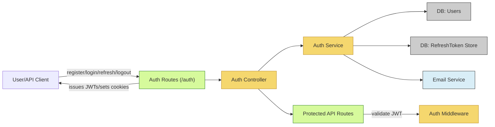

# Authentication Module

## Overview
The Authentication Module delivers user authentication and authorization features to the Hetic Crypto API. It manages user registration, login, email verification, stateless session management (via JWT access and refresh tokens), token refresh, and logout. The module integrates as a system-level security component, protecting user accounts and securing API endpoints.

## Key Features

- **User Registration**:  
  Enables new users to create accounts with a verified email, strong password requirements, and registration rate-limiting for security.
  
- **Email Verification**:  
  Sends a verification email during registration. Users must verify their email address before being able to log in, ensuring account validity.
  
- **User Login**:  
  Authenticates users with email and password, issuing a short-lived JWT access token and a secure refresh token (stored as HTTP-only cookies).
  
- **Access Token Refresh**:  
  Allows clients to refresh their access JWT using a valid refresh token (HTTP-only cookie), supporting seamless session continuity without repeated logins.
  
- **Logout**:  
  Revokes the refresh token on the server and instructs clients to clear the refresh token cookie, effectively ending the session.
  
- **Protected Route Middleware**:  
  Provides an Express middleware to secure API endpoints by validating JWT access tokens on incoming requests.

## System Errors

- **Invalid Credentials**:  
  Occurs when the user provides a wrong email or password during login.  
  *Resolution*: Ensure correct email/password combination and that the account is verified.

- **Unverified Email**:  
  User attempts to log in without completing email verification.  
  *Resolution*: Complete the verification process via the link sent to the user's email.

- **Validation Errors**:  
  Schema checks fail due to malformed input (email format, password strength, etc.).  
  *Resolution*: Confirm all fields meet required formats and retry.

- **Invalid or Expired Refresh Token**:  
  Refresh token is missing, invalid, expired, or revoked.  
  *Resolution*: Re-authenticate via login to issue a new refresh token.

- **Token Expiry or Invalid Token**:  
  JWT access token is missing, malformed, or expired on protected routes.  
  *Resolution*: Use the refresh endpoint for a new access token or re-login if both tokens expire.

- **Email Already Registered**:  
  An attempt to register with an already existing email address.  
  *Resolution*: Use a different email or recover the existing account.

- **Server/Internal Errors**:  
  Uncaught errors during authentication flows.  
  *Resolution*: Review detailed error messages and system logs; contact support if persistent.

## Usage Examples

```typescript
// Register a new user
await fetch("/api/auth/register", {
  method: "POST",
  body: JSON.stringify({ name: "Alice", email: "alice@example.com", password: "Str0ngP@ss!" }),
  headers: { "Content-Type": "application/json" }
});
// => { message: "Registration successful. Please verify your email." }

// Verify email
await fetch("/api/auth/verify-email/<verification-token>", { method: "GET" });
// => { message: "Email verified successfully" }

// Login to receive access and refresh tokens
const response = await fetch("/api/auth/login", {
  method: "POST",
  body: JSON.stringify({ email: "alice@example.com", password: "Str0ngP@ss!" }),
  headers: { "Content-Type": "application/json" }
});
// => { accessToken: "<JWT_ACCESS_TOKEN>" }, plus HTTP-only cookie for refreshToken

// Call a protected endpoint
await fetch("/api/secure/data", {
  headers: { Authorization: "Bearer <JWT_ACCESS_TOKEN>" }
});

// Refresh access token
const response = await fetch("/api/auth/refresh-access-token", { method: "POST", credentials: "include" });
// => { accessToken: "<NEW_JWT_ACCESS_TOKEN>" }

// Logout
await fetch("/api/auth/logout", { method: "POST", credentials: "include" });
// => { message: "Logged out successfully" }
```

## System Integration



This module is central to securing user and API interactions, and its endpoints should be used wherever authentication is required.