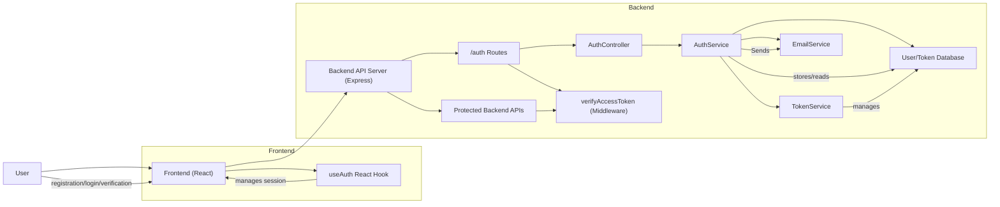

# Authentication Module

## Overview
The Authentication module provides secure, standards-based authentication and session management for both the backend (Node.js/Express) and frontend (React) of the application. It manages user registration, email verification, login, JWT access/refresh token issuance and validation, token refresh, and secure logout. Its purpose is to ensure that only authorized users access protected resources and to provide developers with public endpoints and hooks for integrating authentication into the app's workflows.

## Key Features

- **User Registration**: Allows users to sign up with email, name, and password; sends a verification email to complete activation.
- **Email Verification**: Confirms user ownership of the provided email before enabling login and system access.
- **User Login**: Authenticates user credentials and issues JWT access and refresh tokens. Sets secure HTTP-Only cookie for refresh token.
- **Access Token Refresh**: Issues new access tokens using valid refresh tokens, maintaining seamless authentication without forcing users to re-login frequently.
- **Secure Logout**: Invalidates the refresh token server-side and clears stored tokens client-side, ending the authenticated session.
- **Access Control Middleware**: Backend middleware to protect routes by verifying JWT access tokens and enforcing authorization.
- **Frontend Auth Hook**: Provides React context (`useAuth`) for easily integrating login/logout workflows, access token storage, and session status in the client UI.

## System Errors

- **Invalid Credentials**: Returned when incorrect email or password is provided during login.
  - *Resolution*: Double-check user login input or reset password if forgotten.

- **Unverified Email**: Blocks login if the user's email is not verified.
  - *Resolution*: Complete the email verification process via the link sent during registration.

- **Email Already Registered**: Attempt to register with an existing user email.
  - *Resolution*: Use a different email or attempt password recovery.

- **Refresh Token Expired/Invalid**: Attempting to refresh an access token with an expired or malformed refresh token.
  - *Resolution*: Re-authenticate via login to establish a new session.

- **Token Validation Failure**: Any operation using an expired or malformed JWT (for authentication-requiring API calls).
  - *Resolution*: Trigger token refresh flow or prompt user to re-login.

- **Missing Required Fields**: Registration/login may fail if mandatory fields are omitted.
  - *Resolution*: Ensure that all required fields are provided according to the schema.

## Usage Examples

```tsx
// Register a New User (Client)
await API.post("/auth/register", {
  email: "user@example.com",
  name: "Alice",
  password: "StrongP@ssw0rd!",
});

// Login (Client)
const { login } = useAuth();
await login("user@example.com", "StrongP@ssw0rd!");

// Email Verification (Client/Upon Email Link Click)
await API.get(`/auth/verify-email/{emailVerificationToken}`);

// Protected API Call using Access Token (Client)
const token = localStorage.getItem("token");
await API.get("/protected/resource", {
  headers: { Authorization: `Bearer ${token}` },
});

// Logout Workflow (Client)
const { logout } = useAuth();
await logout();

// Protecting a Backend Route (Express Middleware)
import { verifyAccessToken } from "middleware/auth";
app.get("/protected", verifyAccessToken, (req, res) => res.send("OK"));
```

## System Integration


