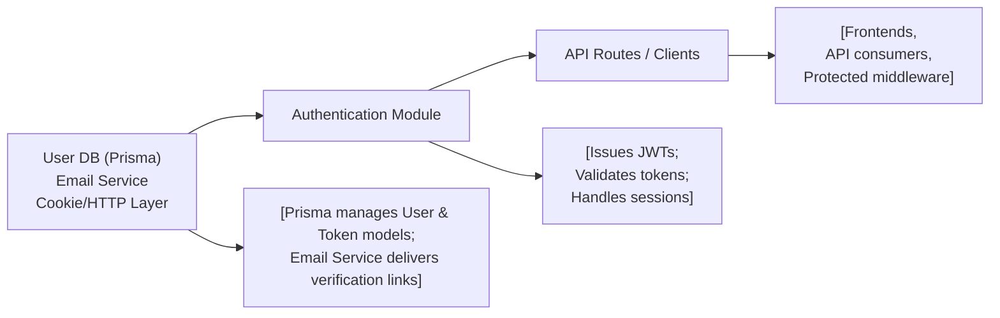

# Authentication Module

## Overview
The Authentication module manages user identity, access control, and session management within the system. It provides endpoints for user registration, login, secure JWT-based authentication, email verification, token refresh, and logout. This module is critical for controlling access to protected resources across the API.

## Key Features

- **User Registration**: Handles secure onboarding of new users, including storing user credentials, hashing passwords, and initiating email verification.
- **Login**: Authenticates users via email and password, issues access and refresh tokens, and enforces email verification before login.
- **JWT Token Management**: Provides short-lived access tokens for API authentication and stores/revokes refresh tokens for secure session continuation.
- **Email Verification**: Sends verification emails with secure tokens to confirm user ownership of the registered email address.
- **Access Token Refresh**: Allows clients to obtain new access tokens by presenting a valid refresh token, enabling seamless experiences without continuous re-authentication.
- **Logout**: Revokes refresh tokens and clears cookies, securely terminating user sessions.
- **Authentication Middleware**: Verifies the presence and validity of access tokens on protected API routes, preventing unauthorized access.

## System Errors

- **Invalid Credentials**: Triggered when the provided email or password is incorrect.  
  *Resolution*: Ensure credentials are correct and retry.

- **Email Not Verified**: Occurs when a user attempts to login before verifying their email.  
  *Resolution*: Complete the email verification step.

- **Email Already Registered**: Raised during registration if the email exists in the system.  
  *Resolution*: Use the password recovery feature or login.

- **Invalid or Expired Refresh Token**: When attempting to refresh an access token using an invalid or expired refresh token.  
  *Resolution*: Login again to obtain new tokens.

- **Unauthorized Access**: Triggered by missing or invalid access tokens on protected routes.  
  *Resolution*: Ensure a valid access token is included in the `Authorization` header.

## Usage Examples

```typescript
// Register User
fetch("/api/auth/register", {
  method: "POST",
  headers: { "Content-Type": "application/json" },
  body: JSON.stringify({ name: "Jane", email: "jane@example.com", password: "yourStrongPassword" }),
});

// Verify Email (link sent to user's email)
fetch("/api/auth/verify-email/<token>", { method: "GET" });

// Login
const res = await fetch("/api/auth/login", {
  method: "POST",
  headers: { "Content-Type": "application/json" },
  body: JSON.stringify({ email: "jane@example.com", password: "yourStrongPassword" }),
});
const { accessToken } = await res.json();

// Access Protected Route
fetch("/api/protected/resource", {
  headers: { Authorization: `Bearer ${accessToken}` },
});

// Refresh Access Token
fetch("/api/auth/refresh-access-token", { method: "POST", credentials: "include" });

// Logout
fetch("/api/auth/logout", { method: "POST", credentials: "include" });
```

## System Integration


