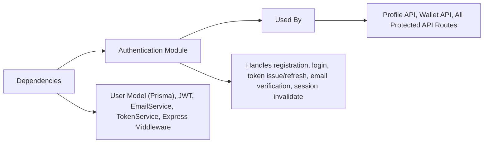

# Authentication Module

## Overview
The Authentication module manages user registration, login, email verification, session management (token issuance and refresh), and logout functionality for the HETIC Crypto API. It provides secure access control, ensuring only verified users can interact with wallet and profile data. This module issues and validates JWT access and refresh tokens, persists session state, and enforces best practices for credential and token lifecycle management.

## Key Features
- **User Registration**: Allows new users to create accounts (`/auth/register`). Enforces password policy and uniqueness of email. Triggers email verification workflow.
- **Email Verification**: Ensures only verified email addresses gain access. Users validate their account via a token sent to their email (`/auth/verify-email/<token>`).
- **User Login**: Authenticates users based on email and password (`/auth/login`). Issues an access token (JWT) for API requests and a refresh token for session continuity.
- **Token Management**: Issues, persists, and validates refresh tokens. Supports access token renewal via `/auth/refresh-access-token` for seamless, secure sessions.
- **Session Invalidation (Logout)**: Revokes user sessions by removing refresh tokens server-side (`/auth/logout`), ensuring user security post-logout.
- **Access Protection Middleware**: Validates and parses access tokens on protected routes, rejecting unauthorized requests.

## System Errors
- **Invalid Credentials**: Returned when an incorrect email or password is supplied.  
  *Resolution:* Check credentials and retry.
- **Email Not Verified**: Returned if user attempts login without verifying their email.  
  *Resolution:* Complete email verification via the provided link.
- **Email Already Registered**: Returned on registration if the email exists.  
  *Resolution:* Use a different email or log in.
- **Invalid or Expired Token**: If access or refresh tokens have expired, are missing, or are tampered.  
  *Resolution:* Refresh access tokens or re-authenticate.
- **Unauthorized Request**: Missing/Bearer token or invalid JWT for protected routes.  
  *Resolution:* Ensure correct Authorization headers with a valid access token.

## Usage Examples

```typescript
// Register a new user
await axios.post('/api/v1/auth/register', {
  name: "Alice Example",
  email: "alice@example.com",
  password: "StrongPass123!"
});

// Login
const res = await axios.post('/api/v1/auth/login', {
  email: "alice@example.com",
  password: "StrongPass123!"
});
const accessToken = res.data.accessToken;

// Refresh access token
const refreshed = await axios.post('/api/v1/auth/refresh-access-token', {}, {
  withCredentials: true // ensures refreshToken cookie is sent
});
const newAccessToken = refreshed.data.accessToken;

// Logout (invalidate session)
await axios.post('/api/v1/auth/logout', {}, { withCredentials: true });

// Protect API routes (server example)
app.get('/api/v1/profile', verifyAccessToken, (req, res) => {
  // Only authenticated users reach here
  res.json({ ... });
});
```

## System Integration


