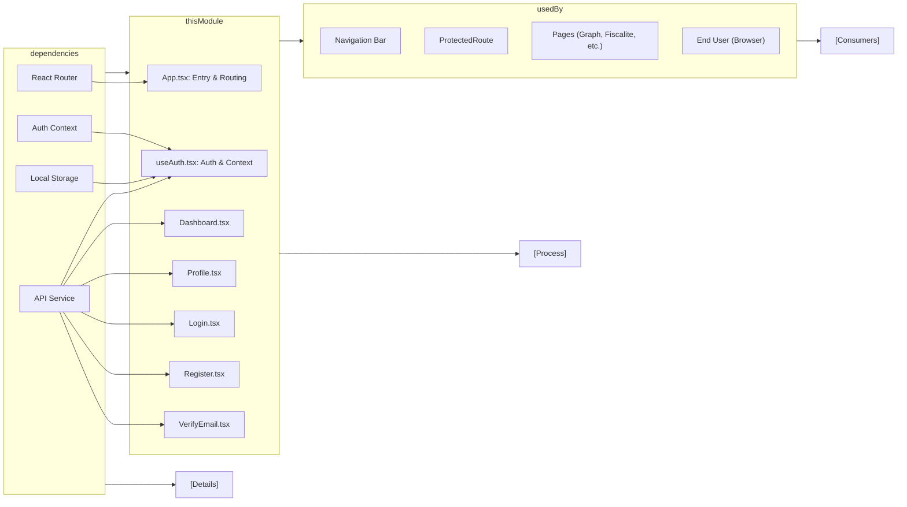

# Client Architecture Module

## Overview
The Client Architecture module organizes the user-facing workflow and navigation for the HETIC Crypto API app. It manages authentication flows, page routing, wallet and profile management, and user feedback. The main purpose is to provide a cohesive, protected client interface ensuring that users see the appropriate content based on authentication status, profile, and wallet data.

## Key Features
- **Authentication Management**: Handles login, registration, email verification, and session (logout) via public API endpoints. Integrates with local storage for session persistence.
- **Protected Routing**: Automatically restricts access to sensitive pages (Dashboard, Profile, etc.) if the user is not authenticated.
- **Dashboard Display**: Shows analytical data on crypto wallet evolution, real-time charts, and portfolio summary for the selected wallet.
- **Profile & Wallet Management**: Enables users to update personal data, change password, add/delete wallets, and view connected wallet information.
- **Email Verification Workflow**: Integrates the email verification step for newly registered users, processes verification tokens, and redirects users as appropriate.
- **Error Feedback & Loading States**: Displays contextual error messages and loading indicators throughout the user journey.
- **System Navigation**: Provides seamless transitions between Home, Login, Register, Dashboard, Profile, and other feature pages.

## System Errors
- **Authentication Failure**: Incorrect credentials or expired token prevent access.  
  *Resolution*: Prompt user to check credentials and retry. If session issues persist, have the user logout and log back in.
- **Registration Error**: Invalid form entries or email/name already in use.  
  *Resolution*: Display API message to user and highlight problematic fields. Encourage user to retry with corrected data.
- **Email Verification Failure**: Invalid or expired verification token.  
  *Resolution*: Show error message; prompt user to request a new verification link.
- **Portfolio/Wallet Data Fetch Error**: Unable to retrieve wallet or portfolio data.  
  *Resolution*: Notify user of data fetch issue, suggest refreshing the page, and display fallback UI as appropriate.
- **Profile Update Error**: Unsuccessful save due to API rejection or validation failure.  
  *Resolution*: Inform user of the error and guide them to check data formats before another attempt.
- **Password Update Error**: Mismatched passwords or incorrect current password.  
  *Resolution*: Clearly indicate which input is incorrect; require password confirmation to match.

## Usage Examples

```tsx
// User authentication (Login page)
import { useAuth } from 'hooks/useAuth';

const { login, user } = useAuth();
login('user@email.com', 'password123');

// Protected page access (Dashboard)
import ProtectedRoute from 'components/ProtectedRoute';

<Route path="/dashboard" element={
  <ProtectedRoute>
    <Dashboard />
  </ProtectedRoute>
} />

// Register a new user
import API from 'services/api';
API.post('/auth/register', { email, password, name });

// Email verification flow
import API from 'services/api';
API.get(`/auth/verify-email/${token}`);

// Fetching wallet and portfolio data (Dashboard/Profile)
API.get('/wallet');           // list wallets
API.get('/portfolio/:id');    // fetch portfolio for wallet

// Update profile information
API.patch('/profile', { email, name });

// Update password
API.patch('/profile/password', { oldPassword, newPassword });
```

## System Integration


