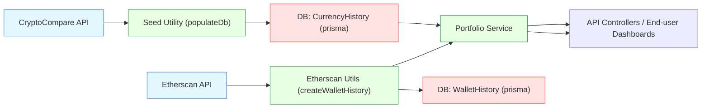

# Crypto Integrations

## Overview
The Crypto Integrations module provides a feature set for retrieving, analyzing, and persisting cryptocurrency-related data (notably Ethereum wallet transactions and currency price history) by integrating with third-party services like Etherscan and CryptoCompare. This module is crucial for monitoring wallet activities, calculating historical values, and offering up-to-date portfolio insights within the broader fintech system.

## Key Features

- **Ethereum Wallet Transaction History**: Aggregates and analyzes on-chain Ethereum transactions (both normal and internal) using the Etherscan API. It allows the system to compute historical wallet values, supporting features like value tracking, performance analysis, and portfolio timelines.
  
- **Real-Time Portfolio Value & Metrics**: Fetches up-to-date Ether wallet balances and historical price data, enabling the calculation of live portfolio value, daily changes, and allocations, thereby powering dashboards and analytics for end-users.

- **Historical Cryptocurrency Price Storage**: Integrates with CryptoCompare to fetch, clean, and continuously store historical price data for cryptocurrencies (such as ETH/EUR) into the system database for later retrieval and analytics, ensuring pricing accuracy for back-calculated wallet values.

## System Errors

- **External API Rate Limiting**: 
  - *Description*: Excessive requests to third-party APIs (Etherscan, CryptoCompare) may result in request throttling or denial of service.
  - *Resolution*: Introduce request throttling (via `sleep` delays), handle 429-rate limit codes, and retry failed requests after cooldowns.

- **Data Fetching Failures**:
  - *Description*: Failures or timeouts in fetching data from external services may disrupt updates or historical calculations.
  - *Resolution*: Implement try/catch blocks, fallback error handling, appropriate logging, and alerting for operators.

- **Database Consistency Issues**:
  - *Description*: Incomplete or duplicate entries can result from interrupted seeding or upserting operations.
  - *Resolution*: Use robust upsert logic and idempotent batch data management, as implemented in currency history ingestion.

## Usage Examples

```typescript
import { createWalletHistory } from 'backend/src/utils/etherscan';

// Retrieve historical value (in ETH) per day for a specific wallet
const history = await createWalletHistory("0xd0b08671ec13b451823ad9bc5401ce908872e7c5");
console.log(history);
// Outputs daily historical balances for the given wallet

import { PortfolioService } from 'backend/src/services/portfolio.service';

const service = new PortfolioService();
const portfolio = await service.get(walletId);
console.log(portfolio);
// Returns allocation, priceData, dailyPrice, value, dailyValue for the wallet

// From backend/src/utils/seed.ts:
await populateDb("ETH", "EUR");
// Fetches and stores ETH/EUR historical data in the database
```

## System Integration


