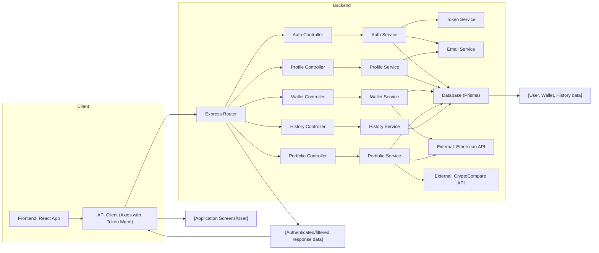

# Data Flow Guide

## Overview
This guide explains how data flows across the main modules of the Crypto API system, with a strong focus on public-facing features, system integration points, and interactions between backend and frontend components. It provides an architectural perspective of authentication, profile, wallet, portfolio, and historical data management, ensuring developers understand the end-to-end data lifecycle and user journey.

## Key Features

- **Authentication & Session Management**: 
  Handles user login, registration, email verification, token-based session management (including access and refresh tokens), and logout. Ensures secure authentication flows and maintains session integrity across client and server.

- **Profile Management**: 
  Allows users to retrieve, edit, and reset their profile and password, supporting secure updates and validation for user details.

- **Wallet Management**: 
  Facilitates CRUD operations for wallets (creation, deletion, retrieval). Wallets are tied to users and are the entry point for all portfolio and historical operations.

- **Portfolio Data & Valuation**: 
  Computes and exposes portfolio allocations, real-time valuation, price history, and daily performance based on wallet contents and external crypto price feeds.

- **Historical Data Retrieval**: 
  Enables users to query past transaction and wallet valuation history, filtered by date or wallet id, providing insight into trends and performance.

- **API Client Integration with Refresh Workflow**:
  The frontend uses a centralized API client with integrated access token management. On token expiry, it automatically attempts to refresh the token using a secure cookie workflow, improving user experience without compromising security.

## System Errors

- **Authentication Errors**: 
  Occur due to invalid login credentials, unverified email, expired or invalid tokens.
  - *Resolution*: Validate credentials, ensure the email is verified. If tokens are invalid or expired, prompt the user to log in again.

- **Input Validation Errors**: 
  Triggered by invalid request formats or missing required fields (e.g., malformed email, missing wallet address/title).
  - *Resolution*: Follow the API’s schema. Provide all required fields correctly.

- **Resource Not Found**: 
  Raised when accessing data (wallet, user, historical records) that does not exist or does not belong to the current user.
  - *Resolution*: Check the given identifiers (IDs), and user permissions.

- **Database Constraint Errors**: 
  Such as attempting to create a wallet with a duplicate address, or edit profile to an email already in use.
  - *Resolution*: Ensure addresses/emails are unique and handle duplicate error codes gracefully.

- **API Token Refresh Failures**: 
  When the backend rejects a refresh token (expired/absent/invalid), causing the frontend to log the user out.
  - *Resolution*: Backend returns unauthorized; frontend clears session and redirects to login after a delay.

## Usage Examples

```typescript
// Login and maintain session (frontend)
import API from "./services/api";
// Login
const res = await API.post("/auth/login", { email, password });
// AccessToken set; refreshToken is managed via HttpOnly cookie

// Fetch user profile (frontend)
const profile = await API.get("/profile");

// Add a new wallet (frontend)
const wallet = await API.post("/wallet", { address: "0x...", title: "My ETH Wallet" });

// Retrieve portfolio values (frontend)
const portfolio = await API.get("/portfolio/123"); // 123 = walletId

// Automatic session refresh (frontend)
// No explicit call: API client transparently refreshes token on `/auth/refresh` error

// Get wallet transaction history (frontend)
const history = await API.get("/history/123", { params: { startDate: "2024-01-01" } });

// Logout (frontend)
await API.post("/auth/logout");

// Backend example: Get portfolio (Node/Express controller)
portfolioController.get(req, res); // Exposes portfolio data for a requested wallet
```

## System Integration


