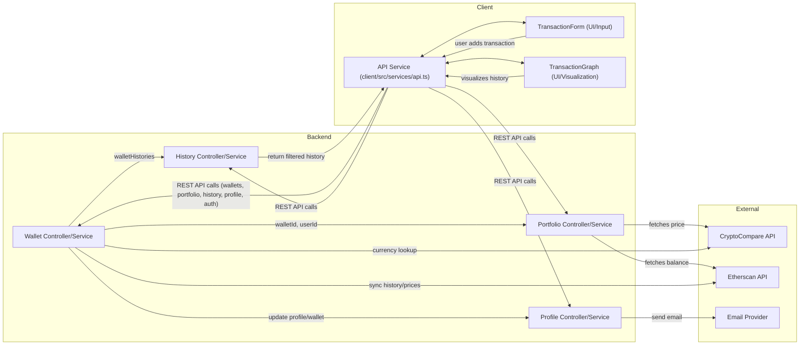

# Data Flow in the Crypto Portfolio System

## Overview
This document describes the data flow for crypto wallet management and transaction visualization in the Hetic Crypto API system. It outlines how wallet, portfolio, profile, and history information moves through backend services and is exposed via APIs for client consumption. The guide also covers how user-driven actions, such as adding transactions and viewing transaction graphs, interact with the backend and visualize aggregated data.

## Key Features

- **Wallet Management**: Add, delete, and list crypto wallets associated with user accounts, syncing wallet history from blockchain APIs and currency databases.
- **Portfolio Data Aggregation**: Produce allocation, pricing, and value change metrics for wallets, combining external price and blockchain data to compute up-to-date portfolio analytics.
- **User Profile Handling**: Securely fetch and modify profile data including name, email, and password management, with email verification workflows.
- **Transaction History Retrieval**: Filter and retrieve wallet transaction history (on-chain events), supporting date-based queries and wallet-specific filtering for detailed user insight.
- **Authentication-aware API Layer**: Middleware-enforced APIs assure user identity for protected operations, auto-refresh access tokens when needed via the client-side API service.
- **Transaction Visualization**: Allow users to input and visualize transaction events. The client generates dynamic graphs (via D3) based on transaction data, animating network and timeline views for user comprehension.

## System Errors

- **Invalid Wallet ID**: Occurs when operations reference a non-numeric or missing wallet identifier.  
  _Resolution_: Ensure the wallet ID is provided and is a number in API requests.

- **Wallet Not Found**: When attempting retrieval or deletion of a non-existing wallet.  
  _Resolution_: Check that the wallet exists and belongs to the current user.

- **Account Edition Failed / Duplicate Email**: Profile edits fail when trying to set an email already in use.  
  _Resolution_: Request a different unique email.

- **Authentication Error (401/403)**: Triggers when lost session or invalid/expired token used for API requests.  
  _Resolution_: Automatic token refresh is attempted. If that fails, the user is redirected to the login page.

- **External API/Data Errors**: May result from failures in price APIs (CryptoCompare, Etherscan), possibly affecting portfolio value computation or wallet sync.  
  _Resolution_: Verify API keys and monitor external service health.

- **Validation Errors**: Inputs not matching required parameters (e.g., missing email, password, address, or malformed fields).  
  _Resolution_: Fix request payload according to required schema.

## Usage Examples

```typescript
// 1. Retrieve all wallets for the logged-in user (client-side)
const response = await API.get('/wallets'); // GET
const wallets = response.data;

// 2. Add a new wallet
const newWallet = await API.post('/wallets', {
  address: '0x1234abc...',
  title: 'Main Wallet',
});

// 3. Fetch wallet history for a given wallet
const history = await API.get(`/wallets/${walletId}/history?startDate=2023-01-01`);

// 4. Get portfolio analytics for a wallet
const portfolio = await API.get(`/wallets/${walletId}/portfolio`);

// 5. Edit user profile
await API.patch('/profile', { name: 'Alice', email: 'alice@example.com' });

// 6. Password reset (change)
await API.patch('/profile/password', {
  oldPassword: 'oldpass123',
  newPassword: 'newpass456',
});

// 7. Client-side: Add a transaction & visualize it
<TransactionForm onAddTransaction={(transaction) => {
  // Add transaction to state or send to backend
}} />

<TransactionGraph /* props as needed, auto-visualizes data */ />

// 8. Automatic token refresh by the client API service:
API.interceptors.response.use( /* ... */ ); // see client/src/services/api.ts
```

## System Integration


