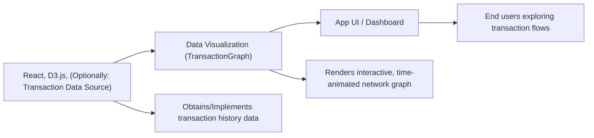

# Data Visualization

## Overview
The Data Visualization module provides an interactive transaction graph for visualizing wallet transactions over time. It presents transaction flows as a dynamic, animated network, making it easy for users to understand how funds move from a main wallet through multiple transactions. It is designed for clear and intuitive exploration of transaction histories within the broader crypto API dashboard.

## Key Features
- **Animated Transaction Timeline**: Progressively animates transaction nodes and links based on their date, providing a time-based visualization of the transaction history.
- **Interactive Network Visualization**: Uses D3.js to render a force-directed graph where nodes represent wallets or transactions, and lines represent their connections.
- **Custom Tooltips**: Displays relevant information (such as transaction ID and value) when hovering over a node to provide contextual insight.
- **Progress Indicator**: A timeline and progress bar shows the animation’s status and the current date being visualized.

## System Errors
- **Graph Not Displayed / Blank Area**: May occur if the TransactionGraph component does not receive data or the D3 rendering fails.  
  *Resolution*: Ensure the required data is available and D3 dependencies are correctly installed.
- **Missing or Incorrect Tooltip Data**: Nodes may show missing or incorrect values if input data is incomplete or improperly formatted.  
  *Resolution*: Validate that all transactions and nodes contain correct IDs and values before rendering.
- **Performance Lags with Large Data**: Large datasets may slow down animation and rendering.  
  *Resolution*: Consider simplifying data or increasing system resources for improved performance.

## Usage Examples

```jsx
// Import the data visualization page or component in a React application

import Graph from 'client/src/pages/Graph';

function App() {
  return (
    <div>
      {/* Other Components */}
      <Graph />
    </div>
  );
}

// The Graph page internally renders the animated TransactionGraph component:
// <TransactionGraph />

// TransactionGraph does not require external props for basic operation,
// but can be adapted to accept real transaction data instead of built-in sample data.
```

## System Integration


