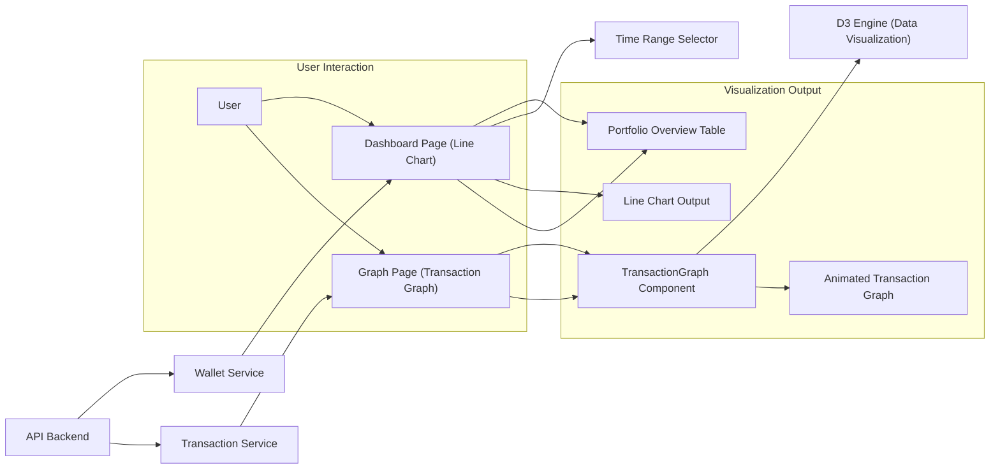

# Data Visualization

## Overview
The data visualization module provides interactive and graphical views of wallet asset evolution and transaction flows within the crypto wallet platform. Its purpose is to help users and stakeholders understand the value trends of their assets and inspect transaction connectivity and progress over time, offering intuitive insights for portfolio tracking and auditing.

## Key Features

- **Portfolio Value Evolution Chart**:  
  Displays historical changes in wallet value as an interactive line chart, allowing users to analyze their asset trends across various time ranges.

- **Time Range Selection**:  
  Enables filtering of portfolio value data by common intervals (1 week, 1 month, 1 year, etc.), making trend detection and comparative analysis straightforward.

- **Portfolio Overview Table**:  
  Summarizes allocation, asset prices, daily variations, and value shifts in a concise tabular form for the active wallet.

- **Transaction Network Visualization**:  
  Shows connections between the main wallet and its transactions using a dynamic D3-based graph. Visualizes nodes (wallets/transactions) and links (flow between them) over time, highlighting amounts and transaction dates.

- **Animated Timeline & Progress Indicator**:  
  Animates transaction graph construction over the time period, accompanied by a visible progress bar and current date indicator for temporal context.

- **Wallet Selection Support**:  
  Allows users to select different wallets and dynamically updates graph and table visualizations based on selection.

## System Errors

- **Data Fetch Error**:  
  _Description_: Occurs when wallet or transaction data cannot be retrieved from the backend API.  
  _Resolution_: Advise the user to retry or check their network connection. Error message is displayed in the interface: _"Failed to fetch data. Please try again later."_

- **Invalid Date Format**:  
  _Description_: Encountered when API or visualization code receives date strings in an unparseable format.  
  _Resolution_: Errors are logged and the date value is shown as-is. Ensure API and frontend agree on date formats (prefer ISO 8601).

- **No Data Available**:  
  _Description_: Triggered if the selected wallet does not have historical or transaction records in the selected time range.  
  _Resolution_: "No data available." message is shown. Switch time range or wallet for different results.

## Usage Examples

```tsx
// Dashboard Page - View Historical Portfolio Value
import Dashboard from 'client/src/pages/Dashboard';

function App() {
  return <Dashboard />;
}

// Graph Page - Visualize Transaction Network
import Graph from 'client/src/pages/Graph';

function App() {
  return <Graph />;
}

// Direct Transaction Graph usage (for custom integration)
import TransactionGraph from 'client/src/components/TransactionGraph';

function CustomVisualization() {
  return <TransactionGraph />;
}
```

## System Integration


