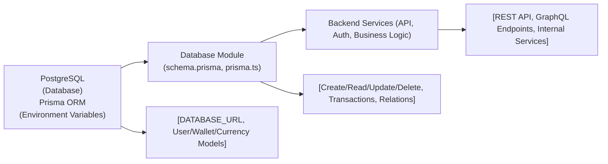

# Database Module

## Overview
The Database module serves as the primary data storage and management layer for the Hetic Crypto API. It uses PostgreSQL as its database technology and Prisma ORM as the interface, providing a structured approach to storing, retrieving, and managing user accounts, wallets, currencies, and their historical data. This module acts as the system’s backbone, enabling all core features that require persistent data access, integrity, and relational consistency.

## Key Features
- **User & Authentication Data Storage**: Manages storage for user credentials, roles, and authentication tokens to power secure login and session handling.
- **Wallet Management**: Tracks user wallets, including multiple addresses and user-defined titles.
- **Wallet History Tracking**: Maintains historical records of balances and values associated with wallets, supporting analytics and audit trails.
- **Currency & Price History**: Stores details about supported currencies and their historical prices, enabling accurate value tracking and reporting over time.
- **Role-based Access Schema**: Differentiates user access via roles (e.g., ADMIN, USER) for system-wide security enforcement.
- **Integration-ready ORM (Prisma Client)**: Provides a high-level, type-safe client to access all database tables and relations without direct SQL, simplifying integration for other backend services.

## System Errors
- **Database Connection Error**: Indicates Prisma is unable to connect to PostgreSQL (e.g., invalid credentials, DB unavailable).
  - **Resolution**: Check PostgreSQL service status, verify credentials/environment variables in `DATABASE_URL`, and confirm network availability.
- **Unique Constraint Violation**: Occurs when attempting to insert or update data with duplicate unique fields (e.g., email, wallet address, currency symbol).
  - **Resolution**: Ensure input data is unique before saving; handle error gracefully in API/business logic.
- **Foreign Key Constraint Error**: Triggered by referencing non-existent related records (e.g., wallet history for an unknown wallet).
  - **Resolution**: Validate that referenced records exist before creating relationships.
- **Environment Variable Not Set**: The `DATABASE_URL` is missing or misconfigured.
  - **Resolution**: Set the required environment variables (typically in `.env`) before starting backend services.

## Usage Examples

```typescript
import { prisma } from "./lib/prisma";

// Create a new user
const user = await prisma.user.create({
  data: {
    email: "john@example.com",
    password: "hashedpassword",
    name: "John",
    role: "USER"
  }
});

// Add wallet for existing user
const wallet = await prisma.wallet.create({
  data: {
    address: "0xabc123...",
    title: "Primary Wallet",
    user: { connect: { id: user.id } }
  }
});

// Record wallet history
await prisma.walletHistory.create({
  data: {
    date: new Date(),
    quantity: 10.5,
    value: 2560.0,
    currency: { connect: { id: 1 } },
    wallet: { connect: { id: wallet.id } }
  }
});

// Fetch user with wallets and their histories
const userWithWallets = await prisma.user.findUnique({
  where: { id: user.id },
  include: { wallets: { include: { history: true } } }
});
```

## System Integration


