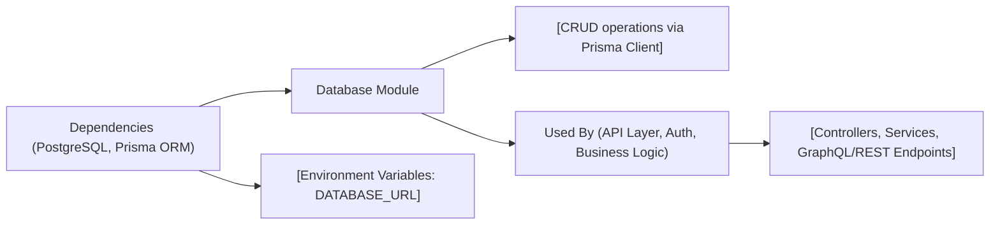

# Database Module

## Overview
The Database Module provides the foundational data storage and retrieval layer for the Hetic Crypto API. It manages core entities such as Users, Wallets, Currencies, and their associated histories, ensuring secure, structured, and performant access via a PostgreSQL backend using Prisma ORM. This module underpins user authentication, wallet management, and currency tracking, making it essential for accurate operations and system integrity.

## Key Features
- **User Management**: Stores user credentials, roles (ADMIN/USER), verification status, and associates wallets and refresh tokens for authentication workflows.
- **Wallet & Wallet History**: Maintains wallets linked to users, tracks wallet address and title, and records transaction history with quantity, value, and currency information for auditability and financial tracking.
- **Currency & Historical Data**: Manages currencies identifiable by unique symbols, stores their descriptive metadata, and tracks price changes over time via CurrencyHistory, supporting analytics and reporting.
- **Refresh Token Authentication**: Provides secure refresh token storage for authentication sessions, enabling stateless, scalable token management.
- **Relational Integrity & Uniqueness**: Enforces data integrity with unique constraints (such as user email, wallet address, currency symbol), ensuring reliable linkage between users, wallets, and currencies.

## System Errors
- **Unique Constraint Violation**: Attempting to create a user with a duplicate email, wallet with an existing address, or currency with a duplicate symbol will result in an error.  
  **Resolution**: Ensure values for these fields are unique before creation; handle exceptions by prompting for alternative input.
- **Missing Required Field**: Creating entities (e.g., wallet, wallet history, currency) without required fields such as address, quantity, or symbol will fail.  
  **Resolution**: Validate input and provide all required fields before submission.
- **Foreign Key Violation**: Attempting to reference non-existent users, wallets, or currencies in relations (e.g., wallet history, refresh token) will generate integrity errors.  
  **Resolution**: Ensure related entities exist prior to creation; handle errors by verifying references.
- **Composite Uniqueness Error**: CurrencyHistory enforces uniqueness on date+currencyId. Attempting to insert duplicate historical entries for a single currency at the same timestamp will be rejected.  
  **Resolution**: Check whether an entry for the currency and date already exists before insertion.

## Usage Examples

```typescript
// Create a new user
const newUser = await prisma.user.create({
  data: {
    email: 'alice@example.com',
    password: 'securePassword123',
    name: 'Alice'
  }
});

// Add a wallet for a user
const wallet = await prisma.wallet.create({
  data: {
    address: 'wallet123address',
    title: 'Main Wallet',
    userId: newUser.id
  }
});

// Record a wallet history (transaction)
await prisma.walletHistory.create({
  data: {
    date: new Date(),
    quantity: 100,
    value: 1500,
    currencyId: 1,      // ID of an existing currency
    walletId: wallet.id // ID of the wallet
  }
});

// Store a new currency and its historical price
const currency = await prisma.currency.create({
  data: {
    symbol: 'BTC',
    name: 'Bitcoin'
  }
});
await prisma.currencyHistory.create({
  data: {
    date: new Date(),
    price: 42000,
    currencyId: currency.id
  }
});
```

## System Integration

